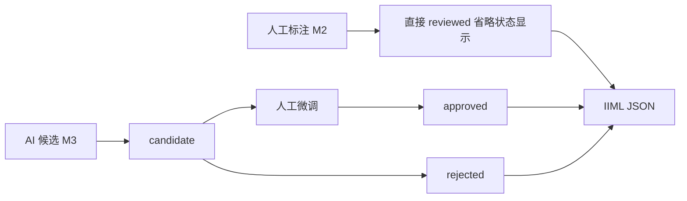

# M2 思考记录与下步规划

> 日期：2026-05-03
> 对应版本：`v0.2.2`
> 关联：[`ROADMAP.md`](ROADMAP.md) · [`RELEASE_NOTES_v0.2.2.md`](RELEASE_NOTES_v0.2.2.md)

本文是 M2 迭代完成后的开发思考与后续规划，重点回答三件事：

1. 论文综述与 IIML schema 如何映射到 M2 / M3 / M4；
2. IIML schema 里已经定义、但 M2 只"占位不启用"的字段；
3. 审定状态（reviewStatus）与 AI 候选流为什么被推迟到 M3。

## 1. 论文综述到迭代路线图的映射

我们目前选型的 5 篇论文 + IIML schema + 知识库草案（`E:\RTI-Learning\docs\04-han-stone-ai\10-iiml-knowledge-base.md`），指向一个分层的标注能力图谱：

```text
采集与衍生   资源层    几何标注层    语义脚本层    证据与归属    知识图谱/导出
  ↓           ↓          ↓           ↓             ↓            ↓
原始照片    IIML       Point       前图像志      研究者/AI     IIML JSON
RTI/法线    resource   LineString  图像志         依据资源     IIIF/COCO
数字拓片    层         Polygon     图像学         候选→审核    .hpsml
3D 模型                BBox        受控术语        多解释并存
线图                    MultiPoly   ICON/AAT/WD
```

把每篇论文、每个 schema 字段落到具体迭代上：

| 来源 | 指示 | 对应工作 |
| --- | --- | --- |
| 论文 35 ICON Ontology | 图像志三层（pre-iconographical / iconographical / iconological）+ 证据资源 + 多解释并存 | M2 三层 textarea + sources[]；多解释延后 M3-2.2 |
| 论文 24 YOLO | YOLO 输出仅作 candidate，类别先聚焦高价值 5-6 个 | M3-2.1 AI 候选流 |
| 论文 25 Relic2Contour | AI 线图必须区分候选 / 确认 / 废弃 | M3-2.1 + reviewStatus 启用 |
| 论文 26 点云线图 | 几何线图 vs 图像边缘线图互补；细分 trace / edge / reliefBoundary | M3-2.1 + M4 资源版本切换 |
| 论文 34 扩散 + LoRA 线图 | 风格化线图必须严格人工审核，防"合理但不存在"的线条 | M3-2.1 |
| IIML schema | resource / annotation / relation / processingRun 四元结构 | M2 annotation + M3 relation + processingRun |
| 知识库 §三元数据架构 | resource / annotation / script 三层分离 | M2 annotation 完成，script 落到 M3 |

## 2. 已"占位"、M3+ 才会真正启用的字段

M2 阶段我们刻意只在 UI 上暴露最小闭环（标签 + 图像志三层 + 术语 + 证据源 + 结构层级 + 题刻条件分支 + 导出 IIML），
但**类型层和存储层对以下字段已经兼容**，后续无需破坏性改造即可启用：

| IIML 字段 | M2 现状 | M3 计划用途 |
| --- | --- | --- |
| `annotation.reviewStatus` | 仅在 `types.ts` 保留枚举，UI 不暴露 | AI 候选流：`candidate → reviewed → approved / rejected`。手工标注不显示该状态 |
| `annotation.generation` | 类型保留 `method / model / modelVersion / prompt / confidence` | SAM / YOLO / Canny / 扩散模型回写 candidate 时使用 |
| `annotation.contains / partOf` | 类型保留，前端暂不渲染父子嵌套 | M3 层级关系：整体画面 → 场景 → 形象 → 构件 → 痕迹 |
| `annotation.confidence` | 类型保留，UI 不显示 | M3 AI 候选的可信度显示与过滤 |
| `termRef.scheme` | M2 固定写 `"WSC3D"` | M3 接入 `ICONCLASS / AAT / Wikidata` 后扩展 UI |
| `source.kind = "resource"` | 字段可填，但 UI 仅 `resourceId` 手填 | M4 一对象多资源时改成从 `resources[]` 下拉选择 |
| `relations[]` | 顶层存在，M2 前端不读取 | M3-2.2 标注间关系（`holds / rides / attacks / alternativeInterpretationOf`）+ 知识图谱边 |
| `processingRuns[]` | 顶层存在，不写入 | M3 AI 调用历史（model / version / parameters / inputResourceIds） |
| `resource.type != "Mesh3D"` | 只创建一条 `Mesh3D` 资源 | M4 支持 `RTI / NormalMap / DigitalRubbing / LineDrawing / PointCloud` |
| `resource.coordinateSystem.transform` | 默认未用 | M4 跨版本坐标变换（RTI ↔ 原图 ↔ 拓片） |
| `annotation.semantics.inscription` | `structuralLevel === "inscription"` 时展示 | 同 M2 |
| `annotation.semantics.preIconographic` | M2 新增，独立 textarea | 继续 |

## 3. 为什么 reviewStatus + AI 候选被推迟到 M3

v0.2.0 重构时决策：纯手工流程不显示审定状态（见 `ROADMAP.md` 第 5 节）。
本次 M2 继续遵循。背后的理由：

- **UI 成本与使用频率不匹配**：纯手工标注时，用户直接"写什么就是什么"，candidate 状态只会增加操作步数；
- **状态语义来自论文 24 / 25 / 34**：这些论文都强调 AI 产出的几何或线图**不能直接采信**，
  必须有候选 / 审核 / 废弃的流转。换言之，审定状态的使用场景**内生于 AI 候选流**，没有 AI 就没有审定；
- **先稳住人类写作**：M2 优先把"图像志三层 + 受控术语 + 证据源"打通，
  等人类流程跑顺，M3 AI 候选回写时**只往同一套 annotation 里塞 `generation.method = "sam|yolo|canny"` 和 `reviewStatus = "candidate"`**，
  现有字段一处不改即可兼容。

具体设计原则：



## 4. M3 启动的前置条件

M3 不应盲目启动。根据本轮研究，进入 M3 之前需要同时满足：

1. **M2 在真实研究场景里跑完至少 1 条画像石**：新建 → 三层释读 → 绑术语 → 加证据源 → 导出 IIML，全流程无明显卡点；
2. **AI 子服务稳定性验证**：在 `ai-service/` 本地跑 SAM / YOLO / Canny，模型权重落位、推理时延可接受；
3. **样本量就位**：至少 5-10 块画像石已有 IIML 文档作为 AI 模型微调的初始语料；
4. **多资源需求出现**：当研究者实际需要同时查看原图 + RTI + 数字拓片时，才启动 M4 资源版本切换；
5. **明确是否需要版本快照**：由用户判断是否把 `data/iiml-history/` 和回滚 UI 排进来。

## 5. M3 / M4 打开清单（备忘）

按优先级从高到低列出：

- **M3-a** 一对象多资源的资源管理器（`resources` tab），支持从本地目录快速添加 RTI / 拓片 / 线图；
- **M3-b** SAM 智能分割：单击 → candidate 多边形回写；
- **M3-c** YOLO 批量候选：扫描 → 列表 Approve / Reject；
- **M3-d** reviewStatus UI（仅 AI 候选场景）：`candidate` 徽标、"审核通过"按钮；
- **M3-e** 标注间关系 + 多解释并存：基于 IIML `relations` 字段的受控谓词；
- **M3-f** 知识图谱 tab（Cytoscape.js）；
- **M4-a** IIIF Web Annotation / COCO JSON / PNG+Mask 导出；
- **M4-b** `.hpsml` 研究包（拼接方案 + IIML + 术语版本快照）；
- **M4-c** 跨版本坐标变换（`coordinateSystem.transform`）。

## 6. 本次迭代的工程副产物

- 前端主 chunk 从 >1 MB 降到约 844 KB（gzip 234 KB）；拼接与标注两大模式拆成独立 chunk 按需加载；
- `AnnotationCanvas` 卸载时显式 `stage.destroy()`；`StoneViewer.disposeObject` 扩展到常用 12 个贴图 slot（`map / normalMap / aoMap ...`）；
- 后端 IIML 校验 schema 维持 `additionalProperties: true` 的宽松策略，
  新字段（`semantics.preIconographic`、`sources[]`）零破坏写入 `data/iiml/<stoneId>.iiml.json`；
- 受控术语 M2 固定 `scheme = "WSC3D"`，外部词表（`ICONCLASS / AAT / Wikidata`）在 `IimlTermRef.scheme` 上留口。

## 7. M2 收尾的交互 / UI 打磨

> M2 主体完成后，基于实际试用回来的反馈做的几轮打磨，均属 UX 层面。

### 7.1 架构层修复

- **保存按钮变灰无法恢复**：原"确定"按钮只在草稿态显示；改为一直显示"保存"按钮，根据 dirty 状态在亮橙色 / 暗灰色间切换，草稿态即使无改动也允许提交。
- **拼接工作区自动添加当前画像石**：删除「进拼接 + 画布空 + 当前画像石有模型 → 自动 addAssemblyStone」的 useEffect，改为完全空白画布、手动从右侧下拉选择 + "+" 加入。
- **拼接 gizmo 在切换模式后失效**：原本条件渲染 `workspaceMode === "assembly" ? <AssemblyWorkspace /> : null` 会 unmount 整个 Three.js 场景，切回时 TransformControls 的 attach 链路在 StrictMode 双 mount 时序下失效。改为 persistent mount：一旦进入过就用 `display: none` 切换可见性，`active` prop 控制 RAF loop 暂停。标注工作区同样改造（顺便解决切回时 Konva Stage 被 cleanup 误销毁导致"矩形/圆/钢笔全部点不出来"的次生问题 —— 原因是 M2 "F2 资源回收"里加的 `stage.destroy()` 在 StrictMode 下回击，已删除该 cleanup）。

### 7.2 标注面板重排（AI 感减负）

**布局重构**：
- 右侧栏从 300 px 加宽到 360 px；
- 删除标注模式下的 `CurrentRecord` / "标注"状态条 / 顶部下载按钮 / "已自动保存"提示；
- 顶部改为两个 tab：**标注**（当前选中标注的编辑）+ **列表**（可见 / 锁定 / 删除 + 最下方 JSON / CSV 下载）；
- 一个标注的编辑只在"标注" tab 里做；列表 tab 仅查看、不修改名称和颜色；
- 证据源 4 个按钮改为 `grid-template-columns: repeat(4, 1fr)` 均分一行，按钮文案缩短为「档案 / 文献 / 资源 / 其他」（hover 仍显示完整语义）。

**去 AI 感的视觉调整**：section 级橙色标题改为纯灰色 12 px label；独立的 `.panel-section` 深色盒子堆叠改为扁平 label + input 的统一字段块；折叠卡片（accordion）全删，三层文本直接并排；tab 用底部 2 px 橙色下划线的 segmented 风格。

### 7.3 交互增强

- **滚轮缩放 / 左键拖动 pan**：Konva 标注层在最上面会吃掉所有鼠标事件，实现两条"事件转发"通道让 OrbitControls 能工作：
  - wheel 事件：`preventDefault` + 重新构造 `WheelEvent` 派发到 3D canvas；
  - pointerdown 在中键 / 选择工具下空白左键时：临时把 `.annotation-canvas-host` 设为 `pointer-events: none` + 派发一个 `PointerEvent('pointerdown')` 到 3D canvas，全局 pointerup 时恢复；距离 < 4 px 时当作单击，触发 deselect。
- **透明度滑动条**：在"标注" tab 的标签下加 0–100 % 滑动条，即时写入 `annotation.opacity`；AnnotationCanvas 根据 `annotation.color` + `opacity` 生成 `rgba(...)` 填充，描边保持不透明。同时修复了"改颜色画布不变"的 bug —— 旧代码里 `fill` 是硬编码的 `rgba(243, 167, 18, 0.06)` / `rgba(46, 196, 182, 0.06)`，现在跟随 color + opacity 实时渲染。
- **保存按钮对即时字段也响应**：层级下拉 / 颜色 / 透明度 / 术语 / 证据源 这些"即时写入 store"的字段，旧实现不参与 `isDirty` 计算，导致用户改了保存按钮不亮。新增 `immediateDirty` 标志：在对应 handler 里 `markDirty()`；`handleSave` 和 `useEffect([annotation?.id])` 时重置。草稿字段（文本类）继续用 draft vs annotation 的 diff，两种来源任一为真都点亮按钮。

### 7.4 数据模型增量

- `IimlAnnotation` 增加可选字段：`opacity?: number`（0–1）；前后端 TS 类型同步；
- 后端 schema 仍是 `additionalProperties: true`，新字段直接落盘到 `data/iiml/<stoneId>.iiml.json`。

### 7.5 其他

- CSV 导出（列表 tab 右下的第二个下载按钮）：UTF-8 BOM + CRLF，Excel / Numbers 直接双击打开中文不乱码；列包括 id / structuralLevel / label / 三层 / terms / inscription × 3 / sources（人类可读文本）/ notes。
- 开发时 StrictMode 双 mount 暴露两处问题（gizmo 链路失效 + Konva Stage 误销毁），均已解决。

## 8. SAM 接入蓝图

M2 尾声决定先把 SAM 这块 M3 大功能的第一阶段做下来，主要因为 AI 子服务接口
（`/ai/sam`）、前端 client 和 IIML 的 `generation / reviewStatus` 字段在 M1 就已经准备好，
剥离阻塞项后"单次点击 → 候选 → 审核"其实是 M2 UI 基础上的自然外延。

### 8.1 四个关键决策与取舍

| 决策 | 选项 | 本轮取舍 | 理由 |
| --- | --- | --- | --- |
| 图像源 | Three.js 当前视角截图 / 高清原图 / 两者可选 | 阶段 1 先用 Three.js 截图，API 同时保留 `imageUri` 字段 | 高清原图在 M3-a 资源管理器落地后再接入；base64 塞 100 MB+ 会卡请求，M3-a 会改用后端直接读本地文件 |
| 权重接入 | 用户自己下载 / 启动时自动拉取 | 启动时自动从 `https://github.com/ChaoningZhang/MobileSAM/raw/master/weights/mobile_sam.pt` 拉到 `ai-service/weights/mobile_sam.pt` | 一键 `npm run dev` 即可用；断网环境下把权重手动塞到同路径也可 |
| 候选 UX | 简单接受/拒绝 / 批量审阅流程 | 批量审阅：面板新增独立"候选 (N)" tab + banner 批量按钮 + 每条三按钮 | 对齐论文 24 YOLO "扫描 → 列表 Approve/Reject/Edit" 的心智，用户拒绝单次误识很低成本 |
| 多 prompt | 单次点击 / 多点累积 / box prompt | 阶段 1 只做单次点击 | 最小闭环验证坐标/后端/审核流；阶段 2 再做多点 |

### 8.2 技术蓝图

```mermaid
flowchart LR
  click[用户在画布点击]
  screenshot[Three.js canvas toDataURL]
  sam["/ai/sam"]
  response[polygon image-normalized]
  canvasPx[canvas pixel]
  modelUV[modelBox uv]
  candidate["annotation reviewStatus=candidate"]
  review[候选 N tab 审阅]

  click --> screenshot --> sam --> response --> canvasPx --> modelUV --> candidate --> review
  review -->|接受| approved[reviewStatus=approved]
  review -->|拒绝| delete[删除]
  review -->|重试| retry[删除 切回 SAM 工具]
```

坐标转换链：
`SAM polygon [u_img, v_img] → 像素 [u_img * canvasWidth, v_img * canvasHeight] → screenToUV → modelBox [u, v]`

### 8.3 后端实现要点

- `ai-service/app/sam.py` 用 `threading.Thread` 在 FastAPI startup 时后台下载 + 加载 MobileSAM，`/ai/health` 暴露 `sam.status` 让前端轮询；
- Predictor 加 `threading.Lock`，`set_image` + `predict` 绑一起，避免并发请求互相覆盖；
- 预测失败或权重不在时回退到 OpenCV Canny 轮廓 fallback，返回 `model: "mobile-sam-fallback-contour"`，前端仍能拿到合法多边形；
- API schema 增加 `imageUri?: string` 字段作为 M3-a 高清图资源的接入口，当前传入直接 400。

### 8.4 前端实现要点

- `AnnotationTool` 枚举加 `"sam"`；工具栏第 6 个按钮；disabled 状态 + tooltip 根据 `/ai/health` 动态切换；
- `frontend/src/modules/annotation/sam.ts` 独立文件承担"截图 + 坐标转换 + 构造 candidate"逻辑；
- AnnotationCanvas SAM 工具下左键触发 `requestSamCandidate`，请求期间光标变 wait；
- AnnotationPanel 新增 `"review"` tab，仅当候选数 > 0 时出现；批量接受 / 拒绝按钮 + 每条候选卡片带置信度 + 接受 / 拒绝 / 重试；
- 列表 tab 每行对 `reviewStatus === "candidate"` 多显示一个橙色"候选"徽标；
- 画布对候选标注用虚线描边 + 默认 0.25 填充透明度（比正常 0.15 更醒目）。

### 8.5 下一阶段（阶段 2）

- 多 prompt 累积：Shift + 左键负点、Alt + 拖 box、debounce 300 ms 刷新候选；
- 候选 prompt 点位可视化（蓝点 / 红点 / 虚线框）；
- 请求可取消（`AbortController`）；
- `processingRuns[]` 写入 IIML，记录每次 SAM 调用的 model / parameters / inputResourceIds；
- M3-a 资源管理器就绪后，SAM 可选"当前视角截图"或"高清原图"；原图通过 `imageUri` 传递给后端。

## 9. 下一步（在 M3 启动前尚可落的 M2 尾巴）

这些都是小量打磨，不属 M3 的大特性：

- **视角复位**：标注模式按"重置视角"把 OrbitControls 拉回"画像石满屏"初始状态；
- **工具热键**：V/R/E/P/G 对应 选择 / 矩形 / 圆 / 点 / 钢笔；
- **Undo/Redo 热键**：Ctrl+Z / Ctrl+Shift+Z（现在只有顶部按钮）；
- **空标签的列表展示**：目前列表空标签只显示"未命名"灰字，考虑补充几何类型标注（如"矩形 · 3"）作为 fallback；
- **按层级分组的列表视图**（可选）：`list` tab 加"按层级折叠"切换，便于标注数量多时浏览；
- **RELEASE_NOTES_v0.2.2.md 补充修复项**：目前 notes 只写了主体功能，本节 7.1 / 7.3 / 7.4 的修复需要补进去，发版前一并整理。

M3 启动条件见 §4，以上尾巴项不阻塞。
