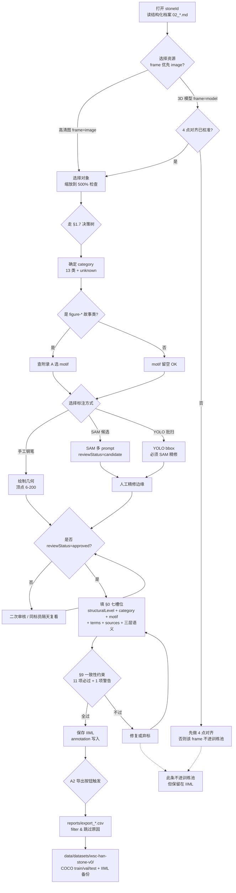

# 汉画像石标注 SOP（v0.3.1）

> 适用范围：WSC3D 平台 M5 Phase 1 数据建设（轨道 A1）
> 输出目标：内部数据集 `wsc-han-stone-v0`（50 stones / 1000 instances）
> 制定日期：2026-05-05
>   - v0.1 初版：9 类 + unknown
>   - v0.2 学界对标扩充：13 类 + motif 二层 + 130+ 母题速查
>   - v0.3：消歧义 + 决策树 + 边界判决 + 工程契约
>   - **v0.3.1（本版）**：批量标注前的管线加固（A1-A5 + B + D 修复）
> 关联文档：[`THINKING_m5.md`](THINKING_m5.md) · [`ROADMAP.md`](ROADMAP.md) · [`PROJECT_BRIEF.md`](PROJECT_BRIEF.md)

本 SOP 回答"怎么标一块汉画像石才是合格的训练数据"。所有规则力求**可机读 + 可一致**，
每一条都附 ✅ 正例和 ❌ 反例。**第一次上手 → 先看 §1.7 决策树**；**碰到争议 → 看 §1.8
边界判决和附录 H FAQ**；**找母题 → 附录 A 速查**；**判读地区风格 → 附录 E**。

> **v0.3.1 管线加固**（vs v0.3，2026-05-05 当晚）
> - **§11 reviewStatus 准入放宽**：`reviewed` / `approved` 都进训练池（原仅 `approved`）。
>   实务流：标员手工创建默认 `reviewed` → 直接进池；AI 候选 `candidate` → 人审过升级到
>   `reviewed/approved` 才进池；`rejected` 永不进池。
> - **§3.4 frame=model 反投影自动化**：训练集导出端实装单应性矩阵反投影。frame=model 标
>   注若已有 4 点对齐 → 自动投到 image 几何写入 COCO；未对齐 → 报 `frame-model-no-alignment`
>   跳过（不再悄悄混入错误几何）。
> - **§14 image_id / 图像复制契约**：image_id 按 (stoneId, resourceId) 联合分配（一块石头多
>   图独立 image_id）；导出时**真正复制**图像文件到 `images/{type}/{stoneId}/`，COCO `width/height`
>   写真实分辨率（image-size 解析 header），不再写死 1500×1500。
> - **新增 `/api/preflight`** 与 UI"预检"按钮：批量标注前一键查 pic 配对 / IIML 缺字段 /
>   训练池估算 / 类别均衡。Top 阻塞理由会直接列出，让标员最先补哪类字段一目了然。
> - **新增 `/ai/quality/{stoneId}`**：图像质量自动校验（长边 / 过曝 / 欠曝 / 拉普拉斯方差），
>   配合预检报告标识"哪些石头不适合训练"。
> - **新增 `data/datasets/stone_split.override.json`**：stone 级 split 人工 override，把 SOP §13
>   P0/P1/P2 优先级映射手动落地（如 P0 全 train、P2 全 test）。
> - **新增 `data/catalog.override.json`**：catalog 配对锁定，消除 `temp/` 模型与 metadata 编号体系
>   错位导致的 `asset-32 / 32` 这类 numericKey 冲突。`forceMatch` 把 stoneId 与模型显式绑死、
>   `dropOrphan` 隐藏 metadata 中无对应档案的孤儿模型、`dropMetadata` 跳过残缺档案；通过
>   `GET /api/catalog/health` 查看当前命中 / 未命中规则。详见 §14 工程契约 & override 文件
>   头部注释。
>
> **v0.3 主要变化**（vs v0.2）
> - **bug 修复**：§3.1 几何工具表名对齐 13 类（删除已废弃的 v0.1 旧名）
> - **新增 §1.7 标员 30 秒决策树** — 看到目标按 10 个分支问题走到 category 终点
> - **新增 §1.8 类别边界 6 大争议判决** — 周公辅成王 / 虞舜 / 西王母属相 / 羽人仙人 / 胡人 / 七盘舞
> - **新增 §3.4 frame 与训练池规则** — image / model 双坐标系下哪边进训练池
> - **新增 §3.5 图像质量门槛** — 长边像素 / 模糊度 / 残损率三道闸
> - **新增 §13 45 块石头标注优先级**（P0/P1/P2 三档，先标 P0 武梁祠系列）
> - **新增 §14 A2 训练池导出目录结构**（COCO + IIML 双轨）
> - **附录 A 修补**：A.4 表格格式统一 / A.5.7 二十四孝完整 24 项核查
> - **新增附录 G 标注流程图（mermaid）**
> - **新增附录 H FAQ 12 条**

---

## 0. 标注一条记录的全貌

每一条 IIML annotation 在保存前必须能填齐下面 7 个槽位（缺 motif 不致命，缺其它 6 项不进训练池）：

| 槽位 | 来源字段 | 含义 |
| --- | --- | --- |
| 几何 | `bbox` / `polygon` / `multiPolygon` / `point` | 像素坐标 |
| 结构层级 | `structuralLevel` | 8 档枚举 |
| **一层类别** | `category`（新增字段，本 SOP §1 定义） | **13 类 + `unknown`**（粗粒度，给 YOLO/SAM 训练） |
| **二层母题** | `motif`（新增字段，本 SOP §1.6 定义） | 自由字符串，建议从附录 A 受控母题表中挑选；可空 |
| 受控术语 | `terms[]` | 至少 1 个 termRef |
| 图像志三层 | `semantics.preIconographic` / `iconographicMeaning` / `iconologicalMeaning` | 三个 textarea，至少前两层有内容 |
| 证据源 | `sources[]` | 至少 1 条，metadata 或 reference 优先 |

> **`category` + `motif` 字段是本 SOP 引入的轻量扩展**，落到
> `annotation.category: HanStoneCategory` 和 `annotation.motif?: string`，
> 与 `structuralLevel` 正交。M5 Phase 1 A1.2 子任务实装到 `frontend/src/modules/annotation/types.ts`。
>
> **三层标签体系职责分工**：
> - `structuralLevel`（IIML 已有）：几何尺度 / 叙事层级（whole → scene → figure → component → trace 等）
> - `category`（本 SOP 新增）：跨石头通用大类，**给 YOLO 训练用**，必须互斥可枚举
> - `motif`（本 SOP 新增）：具体故事 / 视觉母题，**给图像志研究 + 跨石头检索用**（M5 Phase 3 C2 CLIP 检索的 ground-truth）
> - `terms[]`（IIML 已有）：关键词标签，多对多，可任意挂术语库

---

## 1. 类别体系（13 类 + unknown）

> v0.2 在学界三大类（神话祥瑞 / 历史故事 / 现实生活）+ 信立祥、巫鸿、黑田彰孝行图研究 +
> 陈长虹《汉魏六朝列女图像研究》+ 朱浒《汉画像之"格套"研究》基础上细化。
>
> **设计原则**：
> - 每类样本规模预期 ≥ 50 实例（A3 数据集 1000 实例 / 13 类，平均 ~75/类）
> - 互斥（一条 annotation 只属于一个 category）
> - 与论文 24 的 5 类完全兼容（5 类全部覆盖到本表）

### 1.1 类别表

| ID | 中文名 | 学界三大类归属 | 典型对象 |
| --- | --- | --- | --- |
| `figure-deity` | **创世主神** | 神话祥瑞 | 伏羲、女娲、西王母、东王公（四大主神） |
| `figure-immortal` | **仙人异士** | 神话祥瑞 | 羽人、嫦娥、河伯、仙人、雷公、风伯、雨师 |
| `figure-mythic-ruler` | **神话帝王 / 圣贤** | 历史故事 | 三皇五帝、夏禹夏桀、秦始皇泗水捞鼎、孔子见老子、周公辅成王、晏婴管仲 |
| `figure-loyal-assassin` | **忠臣 / 义士 / 刺客** | 历史故事 | 蔺相如完璧归赵、专诸刺吴王、要离刺庆忌、豫让刺赵襄子、聂政刺韩王、荆轲刺秦王、周公辅成王、二桃杀三士、范雎受袍、信陵君迎侯嬴、苏武牧羊、伯夷叔齐、王陵母 |
| `figure-filial-son` | **孝子** | 历史故事 | 董永侍父、老莱子娱亲、伯瑜悲亲、邢渠哺父、丁兰刻木、闵子骞御车、金日磾拜母、郭巨埋儿、曾参啮指、朱明、赵徇、孝乌、魏汤、李善、羊公、申生（24 孝及其变体） |
| `figure-virtuous-woman` | **烈女** | 历史故事 | 楚昭贞姜、鲁义姑姊、秋胡妻（鲁秋洁妇）、梁高行、齐义继母、京师节女、梁节姑姊、齐桓卫姬、齐管妾婧、钟离春自荐、贞夫韩朋、杞梁妻、罗敷采桑、曹娥 |
| `figure-music-dance` | 乐舞百戏 | 现实生活 | 乐工、舞者、百戏艺人、长袖舞、巾舞、建鼓舞、寻橦、跳丸、飞剑、倒立 |
| `chariot-procession` | 车马出行 | 现实生活 | 轺车、辎车、安车、骖马、御者、骑吏、导骑、骐骠、胡汉战争 |
| `mythic-creature` | 神兽祥瑞 | 神话祥瑞 | 青龙 / 白虎 / 朱雀 / 玄武（四神）、麒麟、九尾狐、三足乌（阳乌）、捣药玉兔、蟾蜍、应龙、飞廉、辟邪、天禄、独角兽、舍利、阳遂鸟、龙、凤 |
| `celestial` | **天象日月** | 神话祥瑞 | 日轮（含阳乌）、月轮（含蟾蜍 / 桂树）、北斗、星宿、彩虹、扶桑树、桂树、雷神 |
| `daily-life-scene` | **现实生活场景** | 现实生活 | 庖厨（屠宰、悬挂肉、汲水、舂米）、宴饮、农耕（牛耕、纺织、采桑、舂米、采桐）、冶铁、盐井、渔猎、博弈（六博）、斗鸡、谒见、讲经、献俘、水陆攻战 |
| `architecture` | 建筑 | 现实生活 | 楼阙、双阙、单阙、屋宇、重檐、廊柱、亭榭、桥梁、藻井、斗拱、栏杆、门阙 |
| `inscription` | 题刻榜题 | — | 榜题、题铭、纪年题记、姓名榜、四言七言赞辞 |
| `pattern-border` | 纹饰边框 | — | 云气纹、卷草纹、几何纹、菱形纹、连弧纹、双菱纹、绞索纹、锯齿纹、垂幔纹 |
| `unknown` | 未识别 | — | 残损 / 风化 / 主题待考无法判读时使用 |

> **删除 v0.1 的 `object-secular`** —— 经验上世俗器物（鼎、博山炉、兵器、灯、镜、案）
> 99% 都嵌在 `daily-life-scene` 或具体故事里，单独成类样本会过于稀疏。如确需标独立器物，
> 走 `structuralLevel: component` + `category` 跟随场景父类即可。

### 1.2 类别选择优先级（出现冲突时）

```text
inscription                     ← 只要包含可识读文字就归此类（即使图文一体也优先文字）
↓
figure-deity                    ← 主神在汉画里地位最高，优先于其它
↓
figure-* (deity / immortal / mythic-ruler / loyal-assassin / filial-son / virtuous-woman)
                                ← 叙事人物按"创世神 > 神话帝王 > 忠臣孝子烈女"
↓
figure-music-dance              ← 与 daily-life-scene 重合时优先（乐舞自身是独立题材）
↓
chariot-procession              ← 单独车马优先于"现实生活兜底"
↓
mythic-creature / celestial     ← 神兽 / 天象（神话祥瑞侧）
↓
daily-life-scene                ← 现实生活兜底
↓
architecture                    ← 静物建筑
↓
pattern-border                  ← 纹饰兜底
↓
unknown
```

### 1.3 论文 24 的 5 类映射（保持兼容）

| 论文 24 提议 | 本 SOP v0.2 类别 |
| --- | --- |
| 伏羲女娲 | `figure-deity`（含伏羲 / 女娲 / 西王母 / 东王公） |
| 乐舞 | `figure-music-dance` |
| 车马 | `chariot-procession` |
| 神兽 | `mythic-creature` |
| 建筑 | `architecture` |

### 1.4 多人物 / 多对象一格情况

✅ 一辆轺车 + 御者 + 骖马 = **整组归 `chariot-procession`**，作为 `structuralLevel: scene`，
里面单独的"御者头部"作为 `component` 子标注，类别跟随父类。

❌ 不要把御者单独标 `figure-mythic-ruler` 然后又把整辆车标 `chariot-procession`——
IoU 重叠超过 80% 的双标注会让 YOLO 训练困惑。正确做法：父子用 `relation: partOf` 串起来。

### 1.5 同一画面"叙事故事 + 装饰元素"的处理

武梁祠"楚昭贞姜的故事"那种典型构图：屋宇内贞姜 + 屋外侍女 + 上方榜题 + 周边边饰带。
正确标法：

- 整组（含屋 + 人 + 榜）= `scene` × `figure-virtuous-woman` × motif=`楚昭贞姜`
- 屋 = `figure` × `architecture`（part of 上面的 scene）
- 贞姜本人 = `figure` × `figure-virtuous-woman` × motif=`楚昭贞姜`
- 榜题 = `inscription` × `inscription`
- 边饰带 = `pattern-border` × `pattern-border`

### 1.6 第二层 `motif` 字段（受控母题）

`motif` 字段可空。**如果该 annotation 能识别到一个稳定的"格套（visual schema）"或叙事主题，
强烈建议填**。值从附录 A 的母题速查表中挑选。

为什么要 motif：

- 同一 category 下 motif 不同 → 检索 / 比较高度相关画像石的关键
- M5 Phase 3 C2（CLIP / DINOv2 跨石头视觉相似检索）要用 motif 做 ground-truth 评估
- 学界研究中"格套"理论（朱浒、陈长虹、邢义田等）以 motif 为基本单位

举例：

- `category=figure-filial-son, motif=老莱子娱亲` —— 武梁祠 / 武氏祠 / 乐山柿子湾 / 浙江海宁四地都有，构图相同（父母床榻 + 跌倒的老莱子 + 妻子端果盘）
- `category=figure-loyal-assassin, motif=荆轲刺秦王` —— 山东武氏祠 / 沂南 / 四川乐山 / 陕北 / 浙江海宁五地都有，"中柱 + 匕首 + 荆轲秦王分置"
- `category=figure-virtuous-woman, motif=贞夫韩朋` —— 朱浒 2020 新识别格套（以前曾被误读为"罗敷采桑"）

**没有共识母题的 figure / scene 可以留空 motif** —— 比如纯泛指的"宴饮"、"骑马"、"侍者"。

### 1.7 标员 30 秒决策树（v0.3 新增）

看到一个待标对象时按下面 10 个问题逐层走，绝大多数情况能 30 秒内定到正确 category：

```text
Q1. 是文字 / 榜题吗？
  是 → category=inscription，看附录 A.13 选 motif
  否 → Q2

Q2. 是规则的边饰带 / 几何纹样吗（云气纹 / 卷草纹 / 菱形 / 连弧）？
  是 → category=pattern-border，看附录 A.14 选 motif
  否 → Q3

Q3. 是人形吗（含半人半兽）？
  是 → 进 Q4 人形分支
  否 → 跳 Q8 非人形分支

═════ 人形分支 ═════
Q4. 人首蛇身？
  是 → category=figure-deity，motif ∈ {伏羲女娲交尾 / 伏羲 / 女娲}
  否 → Q5

Q5. 戴玉胜 / 龙虎座 / 与西王母对偶端坐昆仑？
  是 → category=figure-deity，motif ∈ {西王母 / 东王公}
  否 → Q6

Q6. 有翼 / 飞举姿态 / 鸟首鹿身 / 击连鼓 / 持布囊？
  是 → category=figure-immortal，motif ∈ 附录 A.2（羽人 / 嫦娥奔月 / 雷公 / 风伯 / 雨师 / 河伯 / 太一帝君）
  否 → Q7

Q7. 凡人形象，能识别故事或榜题？
  ─ 故事核心是"刺杀 / 完璧 / 持节使臣 / 自杀殉义"等忠义高潮 → figure-loyal-assassin（附录 A.4）
  ─ 故事核心是"侍亲 / 喂食 / 跪拜父母 / 谏父 / 葬亲" → figure-filial-son（附录 A.5）
  ─ 故事核心是"贞节 / 殉夫 / 智辩 / 救子" → figure-virtuous-woman（附录 A.6）
  ─ 故事核心是"会面 / 治国 / 制器 / 三皇五帝单独出场" → figure-mythic-ruler（附录 A.3）
  ─ 故事核心是"乐 / 舞 / 杂技 / 百戏" → figure-music-dance（附录 A.7）
  ─ 都不是（侍者 / 庖厨 / 农夫 / 无榜题市井凡人） → daily-life-scene（作为场景一部分）

═════ 非人形分支 ═════
Q8. 是动物吗？
  是 → 进 Q9
  否 → 跳 Q10

Q9. 动物分支
  ─ 龙凤 / 四神 / 麒麟 / 九尾狐 / 三足乌 / 玉兔 / 蟾蜍 / 应龙 / 飞廉 / 辟邪 → mythic-creature（附录 A.9）
  ─ 马匹（载具 / 骑乘 / 驾车）→ chariot-procession（附录 A.8）
  ─ 庖厨被宰杀 / 田猎被追的牛羊鱼鸟 → daily-life-scene
  ─ 嵌在日轮 / 月轮里 → celestial（附录 A.10）

Q10. 非人非兽
  ─ 车马整体（不仅仅是马）→ chariot-procession
  ─ 楼阙 / 屋宇 / 桥梁 / 亭榭 / 栏杆 → architecture（附录 A.12）
  ─ 日轮 / 月轮 / 星宿 / 北斗 / 扶桑 / 桂树 → celestial（附录 A.10）
  ─ 农具 / 织机 / 鼎炉 / 案几（嵌在场景里）→ 跟随父 scene 的 category，不单独成类
  ─ 都不像 → unknown（不要硬塞）
```

### 1.8 类别边界 6 大争议判决（v0.3 新增）

学界对下面这些跨界对象有过反复讨论。本 SOP **强制选择一种判决，避免同一画面在不同标员手里漂移。**
有不同意见可以走 `alternativeInterpretationOf` 关系而不是改 category。

#### 1.8.1 周公辅成王 → `figure-mythic-ruler`

**判决**：默认归 `figure-mythic-ruler`，motif=`周公辅成王`。

**理由**：构图重点是"圣君治国 / 辅佐典范"，没有忠义自杀 / 刺杀等高潮事件。
跟"二桃杀三士 / 荆轲刺秦王"那种刺客忠义戏路截然不同。

**例外**：若该石上"周公辅成王"明显与一组"专诸 / 要离 / 豫让 / 聂政 / 荆轲"刺客组并列出现，
说明编纂者把它当作"忠义群像"的一部分，可走多解释 → 加一条 `alternativeInterpretationOf`
关系，副本 category=`figure-loyal-assassin`。

#### 1.8.2 虞舜（孝感动天）→ `figure-filial-son`

**判决**：当画面叙事核心是"孝感动天"（象 / 鸟 / 风协助舜耕田）时归
`figure-filial-son`，motif=`孝感动天`。

**例外**：当虞舜单独作为"五帝之一"与黄帝、颛顼等并列出现（"古帝王列像"格套），归
`figure-mythic-ruler`，motif=`三皇五帝`。

**判别要点**：看周边是否有大象 / 飞鸟 / 风的辅助母题——有则孝感动天，无则五帝之一。

#### 1.8.3 西王母身边的属相（龙虎座 / 九尾狐 / 三足乌 / 玉兔 / 蟾蜍 / 羽人）

**判决**：作为西王母的附属属相时**不单独成 figure**，只在 `terms[]` 上挂受控术语
（`object:玉胜` / `mythic-creature:九尾狐` 等）；用 `partOf` 关系与西王母 figure 联系。

**例外**：当属相在画面中**独立成一格 / 占主导**（比如九尾狐单图、捣药玉兔放大独立成图），
按其本类标注：`mythic-creature` motif=`九尾狐` / `捣药玉兔` 等。

**判别要点**：看属相是否占该 frame 面积 ≥ 25% **且** 没有依附于西王母身体。

#### 1.8.4 羽人 vs 仙人 vs 神祇

**判决**：

| 视觉特征 | category | motif |
| --- | --- | --- |
| 有翼 / 飞举姿态 | `figure-immortal` | `羽人` |
| 无翼但侍奉西王母 / 升仙引路 | `figure-immortal` | `仙人`（不可识别具体身份时） |
| 持节戴冠迎墓主 | `figure-immortal` | `太一帝君` |
| 击鼓鸣雷 / 持布囊 / 洒水 / 鱼车水中 | `figure-immortal` | `雷公 / 风伯 / 雨师 / 河伯` |
| 有人形特征但无翼无属相，仅"飘浮"或"立于云端" | `figure-immortal` | motif 留空 |
| 长有兽角 / 兽足但人身 | `mythic-creature`（按怪兽处理） | 按附录 A.9 |

#### 1.8.5 胡人作为母题

**判决**：

- **整组胡汉战争场景** → `chariot-procession` motif=`胡汉战争`
- **单个胡人作为 figure**（识别要点：戴飘带尖顶帽 / 长襦大袴 / 高鼻深目，参邢义田）：
  - 在历史故事里（如金日磾的母亲）→ `figure-filial-son` motif=父故事，term 加 `person:胡人`
  - 在战争场景里 → `daily-life-scene` term 加 `person:胡人 / scene:胡汉战争`
  - 单独门吏 / 仪仗胡人 → `daily-life-scene` term 加 `person:胡人`

#### 1.8.6 七盘舞 / 建鼓舞类"男女仙人嬉戏"

**判决**：构图重点决定 category。

| 主要特征 | category | motif |
| --- | --- | --- |
| 七盘 / 建鼓清晰可见，舞者动作占画面主导 | `figure-music-dance` | `七盘舞 / 建鼓舞` |
| 仙人手持仙药 / 桃 / 飞翔，舞蹈只是次要 | `figure-immortal` | `升仙嬉戏`（自由 motif） |
| 又有舞又有仙界标识（云气、神兽）—— 无法判别主次 | `figure-music-dance`（默认偏现实题材） | 加 source kind=`other` 注明歧义 |

> 当 §1.8 的判决与你的研究观点冲突时：**保留判决用作 category，研究观点写到
> `iconologicalMeaning` 里**，并在多解释场景下加 `alternativeInterpretationOf`。

---

## 2. 结构层级（structuralLevel）8 档

| 值 | 含义 | 几何尺度 | 典型例 |
| --- | --- | --- | --- |
| `whole` | 整石 / 整幅画面 | 占整图 ≥ 80% | "武梁祠后壁画像石全幅" |
| `scene` | 一组叙事 / 一层 | 占整图 10-80% | "第二层烈女故事" |
| `figure` | 单个人 / 兽 / 大型器物主体 | 占整图 1-30% | "楚昭贞姜本人"、"骖马" |
| `component` | figure 的局部组成 | 占整图 0.1-5% | "贞姜的高髻"、"车舆顶盖" |
| `trace` | 浅刻线 / 微痕 / 装饰刻线 | 任意尺度，但是线状 | "屋脊鸟纹的羽毛刻线" |
| `inscription` | 榜题 / 铭文 | 矩形小区域 | "楚昭贞姜（榜题四字）" |
| `damage` | 风化 / 残损 / 后世修补痕 | 任意尺度 | "右下角石断裂残缺区域" |
| `unknown` | 上述都不适用 | — | 拿不准时填这个，**不要硬塞** |

### 2.1 层级判定原则

- **看尺度**：占整图比例是首要判据
- **看叙事角色**：能独立讲故事的就 `scene`；故事里的角色就 `figure`；角色的零件就 `component`
- **看刻法**：连续刻线是 `trace`；剔地或减地的轮廓走 `figure / component`

✅ 一个画面"四层榜题 + 烈女故事四则"——整石 `whole` × 1 + 每层 `scene` × 4 +
每则故事内的人物 `figure` × N + 关键服饰 `component` 选标 + 榜题 `inscription` × N

❌ 不要把 `whole` 和 `scene` 同时标在同一片像素——`whole` 必须严格覆盖整张图，
否则就用 `scene`。

### 2.2 何时标 `damage`

只在它**影响图像志判读**时标——比如残缺区刚好位于关键人物身上，导致这个 figure
归 `unknown`。否则纯粹的边角风化不必标。`damage` 标注 `category` 必为 `unknown`。

---

## 3. 几何标注规范

### 3.1 用什么工具画什么（v0.3 修正：对齐 13 类 category）

> v0.3 修复 v0.2 残留的旧 category 名（chariot-horse → chariot-procession；
> figure-* → 列出全部 6 个新 figure-* 类；删除已废弃的 object-secular 行）。
> "工具"列对应 `AnnotationToolbar` 上的图标顺序：选择 / 矩形 / 圆-椭圆 / 点 / 钢笔 / SAM。

| 类别 | 推荐工具 | 备注 |
| --- | --- | --- |
| `figure-deity` / `figure-immortal` / `figure-mythic-ruler` / `figure-loyal-assassin` / `figure-filial-son` / `figure-virtuous-woman` | **钢笔多边形** 或 SAM 精修 | 边缘紧贴人形轮廓，间距 ≤ 3 px。SAM 边缘飘到背景必须人工修正 |
| `figure-music-dance` | 钢笔多边形 | 长袖舞 / 杂技姿态多变，多边形顶点会偏多（≤ 200） |
| `chariot-procession` | 钢笔多边形 | 把车 + 马 + 人当一个不规则形画一圈 |
| `mythic-creature` | 钢笔多边形 或 SAM | 龙凤蛇身曲线长，SAM 候选优先 |
| `celestial` | 圆 / 椭圆（日月）/ 多边形（扶桑桂树）| 日月圆轮直接用圆工具，扶桑十日用多边形 |
| `daily-life-scene` | 矩形或多边形 | 整组场景用矩形；具体活动（庖厨 / 牛耕等）用多边形 |
| `architecture` | 钢笔多边形 | 楼阙沿瓦楞 / 立柱描，避免"宽松大框" |
| `inscription` | **矩形 BBox** | 矩形足够，文字内容写 `semantics.inscription`，**不要描每个字的边缘** |
| `pattern-border` | **矩形 BBox** | 长条纹饰带用矩形即可，不要描花纹细节 |
| `unknown` | 矩形 | 拿不准时矩形圈出区域 + category=`unknown`，不要硬塞类 |

> **特殊 structuralLevel 工具映射**（与上面 13 类 category 正交）：
>
> - `whole` / `scene` → 矩形（方便后续切片）
> - `component` → 跟父 figure 工具，但顶点数可少（≥ 6）
> - `trace` → **多段线**（LineString，不闭合，描线状刻痕）
> - `damage` → 多边形（跟着裂缝形状画）

### 3.2 几何质量门槛

- **多边形顶点 ≥ 6 个**（避免把人画成五边形）
- **多边形顶点 ≤ 200 个**（超出说明在抠风化裂缝，应改为分多个标注）
- **矩形 BBox 边缘留白 ≤ 5 px**——紧贴对象，不要"宽松框"
- **不允许自相交**（钢笔工具会自动检测，SAM 输出由 polygon-clipping 校正）
- **不允许嵌套**——如果是"画里画"（比如屋内坐着的人），用 `relation: contains` 表达层级，几何上**两个独立 polygon**

### 3.3 SAM / YOLO 候选必须人工精修后才能进训练池

- SAM 候选默认 `reviewStatus: candidate` ——必须改成 `approved` 才会被 A2 导出按钮拉走
- YOLO bbox 不能直接进训练池，必须 **SAM 精修成 polygon → 人工审核 → approved**
- 自动产物在训练池里都打 `provenance.author = "ai-then-human"` 标记

### 3.4 frame 与训练池规则（v0.3 新增）

平台两套坐标系并存（v0.3.0 设计取舍）：

- `frame=image`：高清图自身归一化坐标（pic / 拓片 / 法线图等任意 2D 资源）
- `frame=model`：modelBox UV `(u,v) ∈ [0,1]²`（3D 模型表面参数化坐标）

**训练池只接受 `frame=image` 的 annotation**（YOLO / SAM 都是 2D 图像模型）。`frame=model`
的标注通过 4 点单应性矩阵反向投影到 `frame=image` 后入训练池：

```text
frame=model → 4 点单应性 H → frame=image → 进入训练池
                                    ↑
                需要 culturalObject.alignment 已校准（4 点对齐）
```

**实务规则**：

- ✅ **优先在 `frame=image` 上标**（高清图模式）—— 避免坐标转换损耗
- ⚠️ **3D 模型上的标注**：A2 导出按钮会自动反投影。**前提**是该 stoneId 已完成 4 点对齐
  （`culturalObject.alignment.controlPoints.length === 4`）。未对齐的 model 标注**跳过**，
  在导出报告里列出 `frame-model-no-alignment`
- ⚠️ **等价正射图**（`view=front + frustumScale=1.0`）：图像 UV ≡ modelBox UV，
  其上的标注 `frame=model` 自动等价于 image，无需反投影
- ❌ **跨 frame 标注的"投影态"**（虚线展示）不能进训练池——它本质上是另一 frame 的副本

A2 导出按钮的 `frame` 处理（**v0.3.1 已实装**于
`backend/src/services/training-export.ts::projectAnnToImageFrame`）：

```ts
function projectAnnToImageFrame(ann, doc, matrices) {
  const frame = ann.frame ?? "model";
  if (frame === "image") return ann.target;                                  // 不变
  if (isEquivalentOrthophotoResource(ann.resourceId, doc)) return ann.target; // 等价正射图免转换
  const H = matrices.modelToImage;                                            // 4 点对齐已校准
  if (!H) return undefined;                                                   // 报 projection-failed 跳过
  return projectGeometry(ann.target, p => applyHomography(H, p));             // model→image 反投影
}
```

实际行为：
1. **frame=image** → 几何不变，绑定原 ann.resourceId
2. **frame=model + 等价正射** → 几何不变，绑定该正射图 resourceId（坐标系本就 == image）
3. **frame=model + 非等价 + 4 点对齐** → 几何走 `modelToImage` 矩阵反投影，**强制绑定 OriginalImage**
   (pic/ 高清图)；BBox 经投影后取外包矩形（单应性下矩形不一定保持矩形）
4. **frame=model + 未对齐 + 非等价** → 校验阶段直接报 `frame-model-no-alignment`，不进训练池

COCO `extension.iiml_projected: true` 标识该条几何经过反投影，消费方据此知道坐标系已统一。

### 3.5 图像质量门槛（v0.3 新增）

进训练池的 annotation 所属 image resource 必须满足：

| 质量维度 | 门槛 | 校验方式 |
| --- | --- | --- |
| **分辨率** | 长边 ≥ 1500 px | A2 校验 PNG 尺寸；< 1500 跳过并告警 |
| **聚焦清晰** | 不能整体模糊 | 标员主观判断，不达标的 stoneId 整石标 `data-quality-poor` 元数据 |
| **曝光** | 全图无 > 30% 区域过曝（255）/ 全黑（0） | 启发式：直方图两端总和占比 |
| **残损率** | 关键 figure 不能在残石断裂处 | 标员判断；该 figure category 改 `unknown` |
| **未涂改 / 未数字增强** | 拓片 / RTI 增强图允许；但 PS 修补的不允许 | 元数据 `acquisition` 字段记录 |

**资源类型与训练池关系**：

| resource type | 进训练池？ | 说明 |
| --- | --- | --- |
| `OriginalImage`（pic/ 原图） | ✓ 优先 | YOLO/SAM 主训练源 |
| `Orthophoto`（3D 生成正射）| ✓ | 等价正射可直接当原图用 |
| `Rubbing`（拓片） | ✓ 但单独切分 | 拓片 = 黑白二值图，分布与原图差异大；A4 微调时单独成 split |
| `NormalMap`（法线图） | ✓ 但单独切分 | M5 Phase 2 B2 产出的法线图，数据增强通道 |
| `LineDrawing`（人工线图） | ✓ 但单独切分 | M5 Phase 2 B4 产出 |
| `RTI` 增强图 | ✓ 但单独切分 | M5 Phase 2 B3 产出 |
| `MicroTraceEnhanced`（微痕增强） | ✓ 但单独切分 | M5 Phase 2 B5 产出 |
| `PointCloud` | ✗ | 3D，不进 2D 训练池 |
| `Mesh3D` | ✗ | 3D，不进 2D 训练池 |
| `Other` | 视情况 | 元数据明确说明 |

> **同一对象的"多资源标注"政策**：原图标一次足矣。其它资源（拓片 / 法线 / 重打光）只在
> "原图无法看清此对象"时**重复标一次**，category / motif 一致；A2 导出会**按原图优先**
> 去重（同一 motif + IoU > 0.7 的多版本只保留原图版）。

---

## 4. 图像志三层文本怎么写

参考论文 35 ICON Ontology 的 Panofsky 三层。**长度建议：每层 1–3 句中文，避免长篇散文。**

### 4.1 第一层 `preIconographic`（前图像志 / 直观描述）

只描述"看到了什么"，**不解释、不引典**。

✅ "一妇人发高髻，左向坐，右手前指，身后两女执便面右向侍立。"
❌ "楚昭贞姜在江边等丈夫归来时被洪水淹死的悲壮场面。"（这是图像学层）

### 4.2 第二层 `iconographicMeaning`（图像志 / 主题识别）

说明"这是什么主题 / 故事 / 神话"。能用受控术语就用受控术语。

✅ "楚昭贞姜的故事（烈女主题）。榜题：'楚昭贞姜'（四字二行）。"
✅ "西王母端坐于昆仑神山，左右羽人侍奉，下方九尾狐与三足乌。"
❌ "一组人物。"（信息量太低）

### 4.3 第三层 `iconologicalMeaning`（图像学 / 文化阐释）

说明"为什么墓主选刻这个 / 它在汉墓画像系统中代表什么思想"。
**这一层允许多解释并存，可以引用研究文献**。

✅ "通过烈女故事强调女性的贞节美德，与第二层孝义故事呼应，构成武梁祠'妇—子'伦理对偶
体系（参 Wu Hung 1989）。亦有研究认为该组图与墓主家族的汉代经学背景相关
（参 信立祥 2000）。"
❌ "汉代人很重视道德。"（过于空泛）
❌ 留空——除非主题确定但文化解释尚未有定论，此时填"待考"并附说明。

### 4.4 三层最低门槛

| 层 | 必须 / 选填 | 训练池准入要求 |
| --- | --- | --- |
| `preIconographic` | **必须** | 不得为空，≥ 10 字 |
| `iconographicMeaning` | **必须** | 不得为空，≥ 10 字（拿不准就写"主题待考"+ 描述疑点） |
| `iconologicalMeaning` | 选填 | 可空；空时 `reviewStatus` 仍可 `approved` |

### 4.5 `inscription` 类的特殊规则

`structuralLevel === "inscription"` 时使用题刻条件子面板，三段：

- `transcription`：照原字录入（异体字保留）
- `translation`：现代汉语译文
- `notes`：释读注（比如"原石漫漶，'昭'字据《隶续》补"）

`preIconographic` 写榜题位置和字数，**不重复 transcription 内容**。

---

## 5. 受控术语 `terms[]`

### 5.1 至少 1 个 termRef

每条 annotation 必须挂 ≥ 1 个 termRef，否则训练池审核驳回。

### 5.2 优先级

```text
1. WSC3D 既有词表（terms.json）
2. 现场新增（chip 输入新词，scheme 仍为 WSC3D）
3. 外部映射（M5 Phase 3 才大规模启用，scheme = ICONCLASS / AAT / Wikidata）
```

### 5.3 多 term 的写法

一条 annotation 描述"西王母 + 玉胜 + 龙虎座"——挂 3 个 termRef：
`person:西王母` + `object:玉胜` + 新增 `mythic-creature:龙虎座`。

### 5.4 反例

❌ 一个 figure 挂 10 个 termRef——分散注意力，应当拆成多个 component 子标注分别挂
❌ 全石只挂 `scene:历史故事`——粒度太粗，至少把每则故事各自挂一个 term

---

## 6. 证据源 `sources[]`

每条 annotation 至少 1 条 source。优先级：

| kind | 何时用 | 示例 |
| --- | --- | --- |
| `metadata` | 引用本石的结构化档案 | `{ kind: "metadata", layer: "第二层", panel: "烈女故事" }` |
| `reference` | 引用文献 | `{ kind: "reference", citation: "Wu Hung 1989, p. 142" }` |
| `resource` | 引用本 IIML 中其它 resource（拓片 / 法线图） | `{ kind: "resource", resourceId: "01:rubbing-1989" }` |
| `other` | 自由文本 | `{ kind: "other", text: "现场观察 2026-05-04" }` |

**训练池审核要求**：≥ 1 条 `metadata` 或 `reference` 来源。仅有 `other` 不通过。

---

## 7. 标注间关系 `relations[]`

14 种受控谓词分 4 组（详见 v0.5.0 Release Notes）。本 SOP 给出汉画像石高频用法。

### 7.1 强烈建议建关系的场景

| 关系 | 用法 | 例 |
| --- | --- | --- |
| `partOf` | 部件 → 主体 | "贞姜高髻" partOf "贞姜本人" |
| `contains` | 主体 → 部件 | "贞姜本人" contains "贞姜高髻"（与 partOf 互逆，建一条即可） |
| `holds` | 人 → 器物 | "梁高行" holds "刀" |
| `rides` | 人 → 车马 | "御者" rides "轺车" |
| `faces` | 人 → 人 / 物 | "范雎" faces "魏须贾" |
| `above / below / leftOf / rightOf` | 空间关系 | 自动推导，"采纳"才入库 |
| `alternativeInterpretationOf` | A 学者 vs B 学者 | "ann-A: 青龙" alternativeInterpretationOf "ann-B: 应龙" |

### 7.2 不必每条都建 `partOf`

只在**部件本身有独立图像志意义**时建。比如"轺车的舆"是部件但本身没有图像学意涵 → 不必标 `component`，
也就不需要 `partOf` 关系。

---

## 8. `reviewStatus` 流转

```text
candidate ──人工审核──→ reviewed ──二次审核 / 通过──→ approved
   │                       │
   └───────拒绝──→ rejected ←─────────────┘
```

| 状态 | 谁能进入 | 训练池准入 |
| --- | --- | --- |
| `candidate` | YOLO / SAM 自动产物默认 | **不进** |
| `reviewed` | 一次人工审核通过 | **不进** |
| `approved` | 二次审核通过（同标员或他人） | **进** |
| `rejected` | 任意阶段被拒 | **不进** |
| 无（手工标注） | 手工标注默认无该字段 | **进**（视为 approved） |

> 二次审核可以是同一标员隔天复看，但同一会话内"自审自通"不算。
> Phase 4 引入双标员一致性 (Cohen's κ) 后，此规则升级为强制 2 人 sign-off。

---

## 9. 一致性约束（机器可校验，A2 导出按钮会执行）

进训练池前自动校验，下面任一不满足则该 annotation 跳过 + 在导出报告里列出原因：

1. ✅ 几何字段非空且无自相交
2. ✅ `structuralLevel` 是 8 档之一
3. ✅ `category` 是本 SOP v0.2 §1 定义的 **13 个值 + unknown** 之一
4. ✅ `motif` 可空；非空时建议从附录 A 受控母题表中选（A2 导出按钮校验 motif 时只警告不阻塞）
5. ✅ `terms.length >= 1`
6. ✅ `sources.length >= 1`，且至少 1 条 kind ∈ {`metadata`, `reference`}
7. ✅ `semantics.preIconographic` 长度 ≥ 10 字
8. ✅ `semantics.iconographicMeaning` 长度 ≥ 10 字
9. ✅ `reviewStatus` ∈ {`approved`, undefined（手工）}
10. ✅ `inscription` 类时 `semantics.inscription.transcription` 非空
11. ✅ 多边形顶点 ∈ [6, 200]，BBox 面积 ≥ 64 px²
12. ✅ `category in {figure-loyal-assassin, figure-filial-son, figure-virtuous-woman}` 时
    **强烈建议**填 motif（因为这三类的学术价值就在于具体故事识别，没有 motif 是浪费样本）

不满足 1-11 的 annotation 仍保留在 IIML，只是不进 `data/datasets/wsc-han-stone-v0/`。
12 是 warning，导出仍会通过但报告会标记。

---

## 10. AI 辅助标注的纪律

平台已有 YOLO 批扫 / SAM 多 prompt / SAM 精修 / Canny 线图四条 AI 通道。
为了防止"AI 误线 / 误框"被混进训练池形成数据污染，规则如下：

### 10.1 YOLO 候选

- **永远不直接进训练池**——必须 SAM 精修成 polygon
- 类别冲突时（YOLO 报 person，但实际是羽人）：把 YOLO label 删掉，重写 `category`
- 置信度 < 0.30 的 bbox 直接 reject

### 10.2 SAM 多 prompt / 精修

- 输出永远是 `candidate`
- mask 边缘明显贴在石材纹理上而非对象轮廓上 → reject
- mask 跨越多个对象 → reject + 重新标 prompt
- IoU < 0.5（与人工预期相比） → reject

### 10.3 Canny / 5 种线图

- 线图**只是辅助显示**，不写库不进训练池
- 训练 `LineDrawing` 资源（B4 阶段）需要的是 *人工线图*，不是 Canny 自动产物

### 10.4 多解释场景的特殊处理

同一区域 A 学者标"青龙" / B 学者标"应龙"——**双方都进训练池**，类别都是
`mythic-creature`，受控术语不同；用 `alternativeInterpretationOf` 关系串起来。

---

## 11. 训练池准入门槛速查

> 一句话：**「该石头档案至少看过 + 几何紧贴轮廓 + 三层语义前两层不空 + 受控术语和证据源齐全 + reviewStatus 不是 candidate/rejected」** 就能进。

```python
HAN_STONE_CATEGORIES_V13 = {
    "figure-deity", "figure-immortal", "figure-mythic-ruler",
    "figure-loyal-assassin", "figure-filial-son", "figure-virtuous-woman",
    "figure-music-dance", "chariot-procession",
    "mythic-creature", "celestial",
    "daily-life-scene", "architecture", "inscription", "pattern-border",
    "unknown",
}
NARRATIVE_CATEGORIES_NEED_MOTIF = {
    "figure-loyal-assassin", "figure-filial-son", "figure-virtuous-woman",
}

def is_training_ready(ann: IimlAnnotation, doc: IimlDocument) -> tuple[bool, list[str]]:
    warnings = []
    if not has_valid_geometry(ann): return False, ["geometry-invalid"]
    if ann.structuralLevel not in STRUCTURAL_LEVELS_V8: return False, ["bad-level"]
    if ann.category not in HAN_STONE_CATEGORIES_V13: return False, ["bad-category"]
    if len((ann.semantics.preIconographic or "").strip()) < 10:
        return False, ["pre-iconographic-too-short"]
    if len((ann.semantics.iconographicMeaning or "").strip()) < 10:
        return False, ["iconographic-too-short"]
    if ann.structuralLevel == "inscription":
        if not (ann.semantics.inscription and ann.semantics.inscription.transcription):
            return False, ["inscription-no-transcription"]
    if len(ann.terms) < 1: return False, ["no-terms"]
    if not any(s.kind in ("metadata", "reference") for s in ann.sources):
        return False, ["no-evidence-source"]
    if ann.reviewStatus in ("candidate", "rejected"):
        return False, [f"review-status-{ann.reviewStatus}"]
    # warning（不阻塞）：故事类 category 缺 motif
    if ann.category in NARRATIVE_CATEGORIES_NEED_MOTIF and not ann.motif:
        warnings.append("missing-motif-for-narrative")
    return True, warnings
```

A2 导出按钮（计划下一步实装）会按上述谓词过滤 + 输出一份 `report.csv` 报告
不达标 annotation 的具体原因。

---

## 12. 标注员 checklist（每次保存前 30 秒过一遍）

- [ ] 几何贴合对象轮廓（缩放到 500% 视角检查）？
- [ ] 选了正确的 `structuralLevel`（8 档）？
- [ ] 选了正确的 `category`（13 类 + unknown）？
- [ ] **如果 category 是 figure-* 故事类，是否填了 `motif`？**（在附录 A 速查表中找）
- [ ] `preIconographic` ≥ 10 字、纯描述？
- [ ] `iconographicMeaning` ≥ 10 字、说出主题或注明"待考"+ 疑点？
- [ ] `iconologicalMeaning` 写了或明确留空？
- [ ] 至少 1 个 `terms[]`？
- [ ] 至少 1 条 `metadata` 或 `reference` 来源？
- [ ] 部件 / 主体之间建了 `partOf` 关系？
- [ ] 同一物的多解释建了 `alternativeInterpretationOf`？
- [ ] AI 候选改成了 `approved`（如果是 AI 候选）？
- [ ] 不确定的字段宁可空 / 不挂术语 / 写"待考"，**不要硬填**？
- [ ] **frame=image 优先**？（如在 3D 模型上标，是否已校准 4 点对齐）
- [ ] **图像质量达标**？（长边 ≥ 1500 px / 不模糊 / 不过曝）

---

## 13. 45 块石头标注优先级（v0.3 新增）

> 现有 `画像石结构化分档/` 共 45 份 Markdown 档案（`01_*.md` ~ `45_*.md`）。
> 标员**先做 P0，再做 P1，最后 P2**。前 10 块（基本都是 P0）标完一轮触发 SOP v0.4 评审。

### 13.1 P0 — 优先级最高（武梁祠系列 + 沂南 + 武家林石）

> **判据**：学界研究最深、母题最丰富、有完整结构化档案、本机已有 IIML 占位。
> 这一档对照《武梁祠汉画像石》（巫鸿）/ 沂南汉墓发掘报告等关键文献。

| stoneId | 名称 | 关键母题 |
| --- | --- | --- |
| 01 | 武家林石 | 西王母 / 仙人 |
| 02 | 武氏祠左石室前壁画像石 | 烈女 + 孝义 + 历史故事 |
| 03 | 武氏祠左石室后壁画像石 | 武梁祠后壁四层（楚昭贞姜 / 鲁义姑姊 / 秋胡 / 梁高行 / 董永 / 老莱 / 丁兰 / 邢渠 ……）|
| 04 | 武氏祠左石室西壁画像石 | 西王母 + 历史故事 |
| 05 | 武氏祠左石室顶部前坡画像石 | 神话祥瑞 |
| 06 | 武氏祠左石室顶部后坡画像石 | 神话祥瑞 |

**P0 标注目标**：每石平均 ~30 个 annotation，6 块 = ~180 个，包括所有 13 类样本至少 1 条。

### 13.2 P1 — 第二优先（武氏祠系列其余 + 南阳 / 徐州 / 陕北）

> **判据**：题材丰富但格套与 P0 部分重叠 / 部分独特；用于扩充类别样本均衡。

- 武氏祠前石室 / 后石室 / 双阙等（约 7-8 块）
- 南阳画像石（天文神话 / 雷公 / 七盘舞 / 阳乌蟾蜍——补 `celestial` / `figure-immortal` 类样本）
- 徐州画像石（胡汉战争 + 烈女传——补 `chariot-procession` 胡汉 motif 样本）
- 陕北绥德 / 子洲（牛耕 + 门吏 + 西王母——补 `daily-life-scene` 农耕样本）
- 四川渠县沈府君阙 / 蒲家湾无铭阙 / 乐山麻浩崖墓（董永 + 仙人——补 `figure-filial-son` 跨地区样本）

**P1 标注目标**：每石平均 ~20 个 annotation，~25 块 = ~500 个。

### 13.3 P2 — 最后（残损严重 / 文献稀少 / 题材单一）

> **判据**：训练贡献度低，留到 v1 数据集扩充时补。

- 残损 > 50% 的石头（仅适合标 unknown / damage）
- 单一纹饰带 / 边饰为主的石头
- 未在结构化档案中出现的零散馆藏

**P2 标注目标**：每石 ~5-10 个 annotation，~10 块 = ~80 个。

### 13.4 总账

| 优先级 | 石头数 | 预期 annotation 数 |
| --- | --- | --- |
| P0 | 6 | ~180 |
| P1 | ~25 | ~500 |
| P2 | ~10 | ~80 |
| 缓冲 | — | ~240（重复标注 / 多解释 / AI 精修候选）|
| **合计** | **~41** | **~1000** |

> 时间预估：P0 一块 1-2 天 / P1 一块 0.5-1 天 / P2 一块 0.2-0.5 天。
> 单标员全程约 6-8 周，触发 SOP v0.4 迭代。

### 13.5 进度跟踪

`AnnotationPanel` 头部下拉显示 alignment 状态（"✓"前缀）。M5 Phase 1 计划增加：

- ⏳ 数据集进度面板（A2 导出按钮旁）：显示当前训练池 annotation 总数 + 13 类分布柱状图
- ⏳ 类别样本不足报警：某类 < 30 实例时高亮提示

---

## 14. A2 训练池导出目录结构（v0.3 新增）

> A2"导出训练集"按钮的产物。**目录长这样，前后端 / AI service 都按此契约对接。**

```text
data/datasets/wsc-han-stone-v0/
├── README.md                       数据集说明 + 类别表 + 引用方式
├── SOURCES.csv                     每张图来源 / 摄影者 / 拓制者 / 授权状态
│                                   （CC-BY-NC 公开版 v1 时按此过滤）
├── stats.json                      数据集统计：类别分布 / motif 分布 /
│                                   resource 类型分布 / stoneId 分布 / 图像质量分布
├── images/
│   ├── original/{stoneId}/*.png        OriginalImage 切分（YOLO 主训练）
│   ├── orthophoto/{stoneId}/*.png      Orthophoto 切分
│   ├── rubbing/{stoneId}/*.png         Rubbing 切分
│   ├── normal/{stoneId}/*.png          NormalMap 切分（B2 后启用）
│   └── lineart/{stoneId}/*.png         LineDrawing 切分（B4 后启用）
├── annotations/
│   ├── coco_train.json             COCO 主训练集（70%，原图优先）
│   ├── coco_val.json               COCO 验证集（15%）
│   ├── coco_test.json              COCO 测试集（15%）
│   ├── coco_categories.json        13 类 + unknown 完整定义（id 1-14）
│   ├── motifs.json                 全 motif 受控词表（含频次）
│   └── splits/
│       ├── original_split.json     原图 train/val/test 划分
│       ├── rubbing_split.json      拓片单独划分（避免风格泄漏）
│       └── normal_split.json       法线图单独划分
├── iiml/
│   └── {stoneId}.iiml.json         完整 IIML 文档备份（保留 IIML 链路）
├── relations/
│   └── relations_all.jsonl         全部 relations 一行一条 JSONL（图谱训练用）
└── reports/
    ├── export_{timestamp}.csv      本次导出报告：每条 annotation 是否进训练池 + 原因
    └── quality_warnings.csv        质量警告（缺 motif / frame-no-alignment / 图像分辨率不足等）
```

### 14.1 COCO categories 映射

```jsonc
[
  { "id": 1,  "name": "figure-deity",          "supercategory": "mythic" },
  { "id": 2,  "name": "figure-immortal",       "supercategory": "mythic" },
  { "id": 3,  "name": "figure-mythic-ruler",   "supercategory": "historic" },
  { "id": 4,  "name": "figure-loyal-assassin", "supercategory": "historic" },
  { "id": 5,  "name": "figure-filial-son",     "supercategory": "historic" },
  { "id": 6,  "name": "figure-virtuous-woman", "supercategory": "historic" },
  { "id": 7,  "name": "figure-music-dance",    "supercategory": "daily-life" },
  { "id": 8,  "name": "chariot-procession",    "supercategory": "daily-life" },
  { "id": 9,  "name": "mythic-creature",       "supercategory": "mythic" },
  { "id": 10, "name": "celestial",             "supercategory": "mythic" },
  { "id": 11, "name": "daily-life-scene",      "supercategory": "daily-life" },
  { "id": 12, "name": "architecture",          "supercategory": "daily-life" },
  { "id": 13, "name": "inscription",           "supercategory": "meta" },
  { "id": 14, "name": "pattern-border",        "supercategory": "meta" }
]
```

> `unknown` 不出现在 COCO 训练集中——`unknown` 标注会被 A2 跳过 + 在 reports 里
> 列出 `category-unknown-skipped`。

### 14.2 IIML ↔ COCO 字段保留

A2 导出会把 IIML 字段塞到 COCO `extension`：

```jsonc
{
  "id": 12345,
  "image_id": 67,
  "category_id": 5,
  "bbox": [x, y, w, h],
  "segmentation": [[...]],
  "iscrowd": 0,
  "extension": {
    "iiml_id": "ann-1777886992617-e83f22",
    "iiml_label": "董永（侍父）",
    "iiml_motif": "董永侍父",
    "iiml_structuralLevel": "figure",
    "iiml_terms": ["person:董永"],
    "iiml_reviewStatus": "approved",
    "iiml_resource_type": "OriginalImage",
    "iiml_provenance_author": "wsc3d",
    "iiml_processingRuns": ["run-...", "..."]
  }
}
```

→ 这样训练后的模型权重 `yolo-han-v1.pt` 在 inference 时可以反向 link 回 IIML 标注，
完整溯源链路。

### 14.3 stats.json 的样子

```jsonc
{
  "exportedAt": "2026-06-15T08:30:00Z",
  "totalAnnotations": 1024,
  "totalStones": 41,
  "categoryDistribution": {
    "figure-deity": 87,
    "figure-immortal": 45,
    "figure-mythic-ruler": 32,
    "figure-loyal-assassin": 78,
    "figure-filial-son": 142,
    "figure-virtuous-woman": 96,
    "figure-music-dance": 51,
    "chariot-procession": 88,
    "mythic-creature": 113,
    "celestial": 52,
    "daily-life-scene": 96,
    "architecture": 67,
    "inscription": 43,
    "pattern-border": 34
  },
  "motifDistribution": {
    "西王母": 38,
    "董永侍父": 18,
    "老莱子娱亲": 15,
    "荆轲刺秦王": 9,
    "二桃杀三士": 8,
    "...": "..."
  },
  "resourceTypeDistribution": {
    "OriginalImage": 712,
    "Orthophoto": 198,
    "Rubbing": 87,
    "NormalMap": 27
  },
  "warnings": {
    "missing-motif-for-narrative": 41,
    "frame-model-no-alignment": 12,
    "image-resolution-too-low": 5
  }
}
```

### 14.4 catalog 配对锁定（v0.3.1 新增）

`temp/`（模型）与 `画像石结构化分档/`（metadata）的编号体系不严格对齐：模型文件
比 metadata 编号偏 1（如模型 21xxx 对应 metadata 20）、个别 metadata 用字与模型不一致（如
metadata 37 写"东北墓**门**"、模型 38xxx 写"东北墓**间**"），少数模型完全没有对应
metadata（asset-47 ~ asset-65）。如果纯靠"normalizedName 双向 includes + 数字前缀"的
模糊匹配，会出现两类错乱：

1. **`asset-32 / 32` 同时存在**：metadata 32 与模型 32xxx 互相不模糊匹配，前者关联到 33xxx
   模型，后者退化成 `asset-32`，pic 配对时 numericKey="32" 会同时命中两块 stone。
2. **侥幸正确**：模糊匹配让 metadata 20 关联到模型 21xxx 看起来"对了"，但是数据更新后
   立即破裂。

**解决方案**：`data/catalog.override.json` 显式锁定。

```jsonc
{
  "forceMatch": [
    // 强制把 stoneId 与某个模型文件名绑死
    { "stoneId": "31", "modelFileName": null,
      "note": "metadata 31 描述'承檐石'，temp/ 中无精确匹配；保持 hasModel=false 避免被相邻模型误抢" },

    // 也可以把 fallback 模型扶正成正式 stone（asset-XX 重命名）
    { "stoneId": "stone-east-eaves", "modelFileName": "32xxx东承檐石.gltf",
      "note": "确认这是 metadata 31 的'东承檐石'" }
  ],

  "dropOrphan": [
    // 暂时隐藏 metadata 中无对应档案的孤儿模型；消除 numericKey 冲突
    { "modelFileName": "32xxx东承檐石.gltf", "note": "..." }
  ],

  "dropMetadata": [
    // 跳过残缺 / 不在数据集范围的 .md 档案
  ]
}
```

**自检接口**：

- `GET /api/catalog/health` — 当前 override 命中 / 未命中规则、孤儿模型列表、numericKey 冲突
- `GET /api/preflight` — 上面这份 + pic 配对 + IIML 完整度 + 训练池估算

**工作流**（批量标注前必查）：

1. 修改 `data/catalog.override.json`
2. `POST /api/catalog?force=true` 强制重扫
3. `GET /api/catalog/health` → `numericKeyConflictCount: 0` & `unrecognizedRuleCount: 0` & `unmatchedMetadataCount: 0` 即可放心进标注

任何 `unrecognizedRules`（拼错文件名 / 文件已删）都必须立即修，否则规则静默失效。

---

## 附录 A：13 大类 × 受控母题（motif）速查表

按本 SOP 13 大类系统列出。**右侧"代表母题"** 是 `annotation.motif` 字段建议值，
源自学界（信立祥、巫鸿、黑田彰、朱浒、陈长虹、邢义田、姜生等）共识。

### A.1 创世主神（`figure-deity`）

| 受控母题 motif | 典型构图 / 视觉属相 | 出处地区 |
| --- | --- | --- |
| `西王母` | 戴玉胜、坐龙虎座 / 昆仑山，左右羽人 / 九尾狐 / 三足乌 / 捣药玉兔 / 蟾蜍侍奉 | 全国（汉画绝对主角） |
| `东王公` | 与西王母对偶，仙桃 / 扶桑树，男性主神 | 山东、河南、四川 |
| `伏羲女娲交尾` | 人首蛇身，伏羲持矩 + 日轮，女娲持规 + 月轮，蛇尾相交 | 山东、四川、河南 |
| `伏羲` | 单出，人首蛇身 + 矩 + 日轮 | — |
| `女娲` | 单出，人首蛇身 + 规 + 月轮 + 桂树 | — |

### A.2 仙人异士（`figure-immortal`）

| 受控母题 motif | 典型构图 |
| --- | --- |
| `羽人` | 双翼 + 飞举姿态，常侍奉西王母 / 引路升仙 |
| `嫦娥奔月` | 女性形象 + 月轮 + 蟾蜍 |
| `雷公` | 击连鼓 / 旋绕雷车 |
| `风伯` | 持布囊 / 鼓吹气 |
| `雨师` | 倒酒 / 洒水 |
| `河伯` | 鱼车 / 水中乘龙 |
| `太一帝君` | 持节 / 戴冠，迎接墓主升仙 |

### A.3 神话帝王 / 圣贤（`figure-mythic-ruler`）

| 受控母题 motif | 典型构图 / 故事 |
| --- | --- |
| `孔子见老子` | 二人相对作揖，常带"小儿项橐"在侧 |
| `周公辅成王` | **格套**：中央小孩（成王）头上有华盖，两旁各立一人或数人，全国分布最广的母题之一 |
| `三皇五帝` | 黄帝、颛顼、帝喾、唐尧、虞舜（多带榜题） |
| `夏禹` | 持耒耜、带斗笠 |
| `夏桀` | 坐人形御床（暴君象征） |
| `秦始皇泗水捞鼎` | **格套**：河岸群人以绳捞鼎 + 龙咬断绳 / 不咬断（地区差异） |
| `蚩尤` | 多臂多目 / 兽形 |

### A.4 忠臣义士 / 刺客（`figure-loyal-assassin`）

> 表格 v0.3 修正：所有空白行补上简要格套 / 出处。

| 受控母题 motif | 典型构图 / 格套要点 | 主要出处 |
| --- | --- | --- |
| `荆轲刺秦王` | **最常见格套**：中柱（上插或不插匕首）+ 荆轲与秦王分置两侧 + 秦舞阳 + 樊於期人头匣 | 山东武氏祠 3 幅、沂南 1 幅、四川乐山 3 幅、陕北 1 幅、浙江海宁 1 幅 |
| `二桃杀三士` | **格套**：豆 + 三桃 + 三勇士（公孙接、田开疆、古冶子）+ 齐景公 / 晏子 | 山东嘉祥宋山、河南南阳、陕西绥德四十里铺 |
| `蔺相如完璧归赵` | 秦王 + 柱 + 蔺相如举璧 | 武梁祠 |
| `专诸刺吴王` | 鱼腹藏剑 + 王僚被刺 + 公子光 | 武梁祠、嘉祥宋山 |
| `要离刺庆忌` | 江上船 + 要离持剑 + 庆忌挥拳 | 武梁祠 |
| `豫让刺赵襄子` | 桥下伏击 + 赵襄子车马 + 豫让伏剑 | 山东苍山博物馆 |
| `聂政刺韩王` | 鼓琴入殿 / 自剥面皮 / 自杀 | 武梁祠等 |
| `范雎受袍` / `范雎释魏须贾` | 须贾跪谢罪 + 范雎门人在前 | 武梁祠 |
| `信陵君迎侯嬴` | 信陵君驾车 + 侯嬴揖立街旁 | — |
| `管仲射小白` | 管仲弯弓 + 小白（齐桓公）中钩 | 山东嘉祥武氏祠 |
| `苏武牧羊` | 持节 + 羊群 + 北海风雪 | — |
| `伯夷叔齐` | 不食周粟 + 采薇 + 兄弟二人 | 曹操墓 |
| `义人赵宣（赵盾喂灵辄）` | 桑树下喂饭 + 灵辄饿仰 | 曹操墓 |
| `王陵母伏剑` | 母自刎以激励儿子忠汉 + 使者持节 | — |
| `季札挂剑` | 剑挂徐君墓上 + 季札揖立 | — |
| `赵氏孤儿` | 程婴 + 公孙杵臼 + 婴儿 | — |
| `曹子劫桓` | 曹沫劫齐桓公 + 鲁庄公台上 | — |
| `鸿门宴` | 项庄舞剑 + 樊哙闯帐 + 项羽刘邦对坐 | — |
| `申生愚孝` | 申生自杀 + 骊姬 + 晋献公 | 曹操墓（榜题"前妇子字申生"） |

### A.5 孝子（`figure-filial-son`）

> 黑田彰 / 巫鸿 / 朱浒研究：分"通行母题（5 类）+ 泛化母题（3 类）"。
> 与元代《二十四孝》之间不完全重合，汉画孝子有自己的早期形态。

#### A.5.1 通行母题：侍亲（在世父母）

| motif | 格套要点 |
| --- | --- |
| `董永侍父` | **格套**：树 + 推车（父亲在车上 + 鸠杖）+ 董永持锄回望，常带罐 / 庄稼。山东武梁祠、大汶口、四川乐山柿子湾、渠县沈府君阙、渠县蒲家湾、乐山麻浩 |
| `老莱子娱亲` | **格套**：父母坐床榻 + 老莱子跌倒装婴儿啼 + 妻子端果盘（武梁祠完整版）。武梁祠、武氏祠、四川乐山柿子湾、浙江海宁（站姿跳舞变体）|
| `伯瑜悲亲` / `柏榆伤亲` | **格套**：成年伯瑜跪地掩面而泣 + 持杖佝偻母亲。武梁祠、武氏祠、开封白沙镇、乐山柿子湾、北京大学图书馆藏拓 |
| `邢渠哺父` | **格套**：邢渠跪坐前倾 + 持筷喂父。武梁祠、武氏祠、泰安大汶口、开封白沙镇 |
| `赵徇哺父` | 同邢渠格套但赵徇站立（年幼） | 

#### A.5.2 通行母题：祭亲（亡父亡母）

| motif | 格套要点 |
| --- | --- |
| `丁兰刻木事亲` | **格套**：木刻人形（圆形堆叠或抽象人形）+ 丁兰双手作揖 + 妻子（部分版本）。武梁祠、武氏祠、开封白沙镇 |
| `金日磾拜母` | **格套**：屋宇内胡人女性（戴飘带尖顶帽）+ 金日磾跪拜。山东武梁祠（榜题"骑都尉""休屠像"）、内蒙古和林格尔壁画、曹操墓（朱浒 2020 新识别）|

#### A.5.3 通行母题：谏亲

| motif | 格套要点 |
| --- | --- |
| `闵子骞御车失棰` | 闵子骞驾车 + 棰跌落 + 父发现继母虐待 | 武梁祠、四川乐山柿子湾 |
| `孝孙原毂` | 谏父弃祖 | — |

#### A.5.4 通行母题：葬亲

| motif | 格套要点 |
| --- | --- |
| `孝乌` | 反哺老乌 | — |

#### A.5.5 通行母题：护亲

| motif | 格套要点 |
| --- | --- |
| `魏汤护亲` | — | — |

#### A.5.6 泛化母题：孝忠 / 孝悌 / 孝义

| motif | 类别 | 格套要点 |
| --- | --- | --- |
| `曾母投杼` | 孝忠 | 织机 + 三人传讹 + 曾母投杼下机 |
| `李善抚孤` | 孝忠 | — |
| `朱明孝行` | 孝悌 | 武梁祠：朱明 + 朱明弟 + 章孝母 + 朱明妻抱婴 |
| `三州孝人` | 孝义 | 陌生人之间的"孝义" |
| `羊公孝行` | 孝义 | — |

#### A.5.7 元代二十四孝完整核查（v0.3 修补）

> 二十四孝完整 24 个故事最终在元代郭居敬《全相二十四孝诗选》定型，但其中部分在汉画已有早期形态。
> 本表 v0.3 完整 24 项核查，标员遇到二十四孝里非汉画形态的故事 → 不进训练池（写 `unknown` 或不标）。

| # | 元代 motif | 主角 | 朝代背景 | 汉画状况 | 本 SOP 处理 |
| --- | --- | --- | --- | --- | --- |
| 1 | `孝感动天` | 虞舜 | 上古 | 部分（与五帝交叉）| §1.8.2 决策：见象 / 飞鸟 → filial-son；五帝列像 → mythic-ruler |
| 2 | `亲尝汤药` | 汉文帝 | 西汉 | 罕见 | 不进训练池 |
| 3 | `啮指痛心` | 曾参 | 春秋 | 部分有 | filial-son，motif=`啮指痛心` |
| 4 | `百里负米` | 仲由（子路） | 春秋 | 部分有 | filial-son，motif=`百里负米` |
| 5 | `芦衣顺母` | 闵损（子骞） | 春秋 | **见** | **= A.5.3 `闵子骞御车失棰`**（汉画构图与元代芦衣顺母不同） |
| 6 | `鹿乳奉亲` | 郯子 | 春秋 | 罕见 | 不进训练池 |
| 7 | `戏彩娱亲` | 老莱子 | 春秋 | **见** | **= A.5.1 `老莱子娱亲`** |
| 8 | `卖身葬父` | 董永 | 东汉 | 部分（汉画董永故事更强调"侍父"）| **不直接采用元代 motif，用 A.5.1 `董永侍父`** |
| 9 | `刻木事亲` | 丁兰 | 东汉 | **见** | **= A.5.2 `丁兰刻木事亲`** |
| 10 | `行佣供母` | 江革 | 东汉 | 罕见 | 不进训练池 |
| 11 | `怀橘遗亲` | 陆绩 | 三国吴 | 偶见 | filial-son，motif=`怀橘遗亲` |
| 12 | `埋儿奉母` | 郭巨 | 东汉 | **见（武梁祠等）** | filial-son，motif=`埋儿奉母` |
| 13 | `扇枕温衾` | 黄香 | 东汉 | 偶见 | filial-son，motif=`扇枕温衾` |
| 14 | `拾葚异器` | 蔡顺 | 西汉 | 罕见 | 不进训练池 |
| 15 | `涌泉跃鲤` | 姜诗 | 东汉 | 罕见 | 不进训练池 |
| 16 | `闻雷泣墓` | 王裒 | 三国魏 | 罕见 | 不进训练池 |
| 17 | `乳姑不怠` | 崔山南 | 唐 | 唐宋以后定型 | 不进训练池 |
| 18 | `卧冰求鲤` | 王祥 | 西晋 | 唐宋以后定型 | 不进训练池 |
| 19 | `恣蚊饱血` | 吴猛 | 东晋 | 唐宋以后定型 | 不进训练池 |
| 20 | `扼虎救父` | 杨香 | 晋 | 唐宋以后定型 | 不进训练池 |
| 21 | `哭竹生笋` | 孟宗 | 三国吴 | 唐宋以后定型 | 不进训练池 |
| 22 | `尝粪忧心` | 庾黔娄 | 南齐 | 唐宋以后定型 | 不进训练池 |
| 23 | `弃官寻母` | 朱寿昌 | 北宋 | 宋代故事 | 不进训练池 |
| 24 | `涤亲溺器` | 黄庭坚 | 北宋 | 宋代故事 | 不进训练池 |

**汉画里有但元代二十四孝没收的孝子故事**（汉画原生母题）：
- `董永侍父` / `老莱子娱亲` / `丁兰刻木事亲`（元代有相近版本但格套不同）
- `伯瑜悲亲` / `邢渠哺父` / `赵徇哺父` / `闵子骞御车失棰` / `孝孙原毂`（汉画独有 / 元代未收）
- `金日磾拜母`（黑田彰指出：日本两本《孝子传》和《孝子传逸文》均无此条）
- `朱明孝行` / `孝乌` / `魏汤护亲` / `三州孝人` / `羊公孝行` / `李善抚孤`（黑田彰系统识别）

> **简单规则**：标汉画孝子时**优先用本 SOP §A.5.1-A.5.6 的 motif**，元代二十四孝里 #5/#7/#9 是其等价别名（互通），其余 21 项里**仅 #1/#3/#4/#11/#12/#13** 在汉画偶见，标时直接用元代 motif 名；其余在汉画罕见，遇到当 `unknown` 处理。

### A.6 烈女（`figure-virtuous-woman`）

> 来源：刘向《列女传》+ 陈长虹《汉魏六朝列女图像研究》。

| motif | 格套要点 |
| --- | --- |
| `楚昭贞姜` | **格套**：屋宇内贞姜端坐 + 屋外侍女执便面 + 江水（部分版本），武梁祠典型 |
| `鲁义姑姊` | **格套**：妇人怀抱小儿（兄子）右奔回首 + 童子（姑姊儿）+ 二马驾车（齐将军）+ 骑吏弓步卒，武梁祠 |
| `秋胡妻 / 鲁秋洁妇` | **格套**：桑树 + 筐 + 妇女执钩采桑回首 + 秋胡持囊（戏妻情节）|
| `梁高行` | **格套**：帷慢 + 妇人坐 + 持镜持刀（割鼻拒聘）+ 持节使者 + 奉金者，武梁祠 |
| `齐义继母` | **格套**：齐继母面对二子 + 使者 + 双子争死场景，体现"义"|
| `京师节女` | **格套**：节女夜代夫卧床受刺 + 仇家持刀 + 烛光 |
| `梁节姑姊` | **格套**：抢救幼侄而舍亲子 + 火灾屋宇 + 节姑姊抱兄子 |
| `齐桓卫姬` | 卫姬不饮卫国进献酒（讽桓公伐卫）+ 桓公席间 |
| `齐管妾婧` | 妾婧解谜释管仲不快 + 管仲席间问答 |
| `钟离春自荐` | 钟离春拜见齐宣王 + 齐宣王坐席 + 自陈四殆 |
| `贞夫韩朋` | **格套**（朱浒 2020 新识别）：王者 + 女子搭弓射箭 + 男子爬梯荷物（箭头绑书信）。在敦煌《韩朋赋》出现前已是稳定汉画格套 |
| `杞梁妻` | 哭夫崩城 + 城下哀妇 + 长城断裂 |
| `罗敷采桑` | 桑树 + 采桑女罗敷 + 太守车马（乐府《陌上桑》） |
| `曹娥投江` | 江岸 + 投江少女 + 父亲尸骸 |
| `七女为父报仇` | 七位女子为父复仇 + 仇家被斩 / 武器 |

### A.7 乐舞百戏（`figure-music-dance`）

| 受控母题 motif | 典型构图 |
| --- | --- |
| `长袖舞` | 长袖飞扬的女舞者 |
| `巾舞` | 持巾的舞者 |
| `建鼓舞` | 围绕大鼓击打 + 舞蹈 |
| `七盘舞` | 在七盘上跳跃，男女仙人欢快（南阳） |
| `寻橦` | 顶杆 / 顶人杂技 |
| `跳丸` | 抛接多个球 |
| `飞剑` | 抛接刀剑 |
| `倒立` | 倒立杂技 |
| `鼓吹乐` | 排箫 / 笙 / 鼓的乐工集合 |
| `庖厨乐舞` | 与庖厨同框的乐舞场景 |

### A.8 车马出行（`chariot-procession`）

| 受控母题 motif | 典型构图 |
| --- | --- |
| `墓主出行` | 主车 + 多列骑吏导骑 |
| `谒见车马` | 双方车马相对停驻 |
| `胡汉战争` | 山峦 + 胡兵（飘带尖顶帽）vs 汉军（沂南汉墓墓门横额经典） |
| `献俘车马` | 俘虏被押 |
| `导骑` | 单独导骑 |

### A.9 神兽祥瑞（`mythic-creature`）

| 受控母题 motif | 典型构图 |
| --- | --- |
| `四神` | 青龙 + 白虎 + 朱雀 + 玄武四方配置 |
| `青龙` | 单出 |
| `白虎` | 单出 |
| `朱雀` | 单出 |
| `玄武` | 龟蛇相缠 |
| `麒麟` | — |
| `应龙` | 有翼之龙 |
| `九尾狐` | 西王母伴侣 |
| `三足乌（阳乌）` | 日轮中的乌 / 单飞 |
| `捣药玉兔` | 月轮中或西王母侧 |
| `蟾蜍` | 月轮 |
| `飞廉` | 鸟首鹿身 |
| `辟邪 / 天禄` | 翼狮 |
| `独角兽` | — |
| `舍利` | 曹操墓榜题"舍利也" |
| `阳遂鸟` | 曹操墓榜题"阳遂鸟" |

### A.10 天象日月（`celestial`）

| 受控母题 motif | 典型构图 |
| --- | --- |
| `日轮` | 圆轮 + 阳乌 |
| `月轮` | 圆轮 + 蟾蜍 / 桂树 / 玉兔 |
| `北斗` | 七星连线 |
| `星宿` | 二十八宿等 |
| `日月并明` | 日月同现 |
| `扶桑树` | 十日所栖之树 |
| `桂树` | 月中桂树 |
| `彗星` / `流星` | — |

### A.11 现实生活场景（`daily-life-scene`）

#### A.11.1 生产劳动

| motif | 备注 |
| --- | --- |
| `牛耕` | 二牛抬杠 / 一牛挽犁 |
| `纺织` | 织机 + 纺女 |
| `采桑` | 桑树 + 采桑妇 |
| `舂米` | 舂臼 + 杵 |
| `冶铁` | 风箱 + 锻打（山东、河南）|
| `盐井` | 四川画像砖典型 |
| `捕鱼` | 网 / 鱼罶 |
| `狩猎` | 弓箭 + 猎犬 |
| `田猎` | 林中 + 多人 |

#### A.11.2 日常生活

| motif | 备注 |
| --- | --- |
| `庖厨` | 屠宰 + 悬挂肉 + 打水 + 煮食 |
| `宴饮` | 主宾对坐 + 案 + 樽 + 乐舞 |
| `六博` | 博弈 + 棋盘 + 双方对弈（多带仙人化） |
| `斗鸡` | 二鸡相斗 |
| `射雀` | 楼阙下射雀 |

#### A.11.3 社交礼仪

| motif | 备注 |
| --- | --- |
| `谒见` | 主人坐 + 来客拱手 |
| `讲经` | 老师坐 + 弟子环坐 |
| `献俘` | 战利品 + 跪俘 |

#### A.11.4 战争

| motif | 备注 |
| --- | --- |
| `水陆攻战` | 战船 + 步骑 |
| `胡汉战争` | 沂南汉墓墓门横额（也可归 A.8） |

### A.12 建筑（`architecture`）

| 受控母题 motif | 备注 |
| --- | --- |
| `双阙` | 一对汉阙 |
| `单阙` | 单阙 |
| `楼阁` | 二层 / 三层 |
| `屋宇` | 单层屋 |
| `亭榭` | — |
| `桥梁` | — |
| `藻井` | 顶部装饰 |
| `斗拱` | 屋下木构 |

### A.13 题刻（`inscription`）

| 受控母题 motif | 备注 |
| --- | --- |
| `人物榜题` | 标注画面人物身份（如"楚昭贞姜"）|
| `故事榜题` | 标注故事主题（如"董永千乘人也"） |
| `纪年题记` | 含具体年号 |
| `造作题记` | 标识画师、工匠或墓主 |
| `赞辞` | 四言 / 七言赞颂文 |

### A.14 纹饰（`pattern-border`）

| 受控母题 motif | 备注 |
| --- | --- |
| `云气纹` | — |
| `卷草纹` | — |
| `菱形纹` | — |
| `连弧纹` | — |
| `双菱纹` | — |
| `锯齿纹` | — |
| `绞索纹` | — |
| `垂幔纹` | — |
| `兽面纹` | — |

---

## 附录 B：武梁祠后壁画像石（stoneId=02）参考标注样例

> 基于 `画像石结构化分档/02_武氏祠左石室前壁画像石.md` 内容（武梁祠一，第三幅后壁画像）。
> 这一份是 SOP 的"教科书示例"，标员遇到争议时回看本附录。

### B.1 整石与四层

```jsonc
// 整石
{
  "structuralLevel": "whole",
  "category": "unknown",  // 整石作为多场景集合，category 给最常出现类
  "motif": null,
  "geometry": { "kind": "bbox", "x": 0, "y": 0, "w": 1, "h": 1 },
  "label": "武梁祠后壁画像石全幅",
  "terms": ["scene:历史故事"],
  "semantics": {
    "preIconographic": "画面自上而下分四层，最上为卷云纹边饰，第三四层中部刻一楼双阙贯通。",
    "iconographicMeaning": "武梁祠后壁画像石，第三幅原石编号'武梁祠一'。",
    "iconologicalMeaning": "武梁祠以四层叙事结构呈现儒家伦理与神仙世界的对偶（参 Wu Hung 1989；信立祥 2000）。"
  },
  "sources": [{ "kind": "metadata", "layer": "总述/形制" }]
}

// 第二层（烈女）
{
  "structuralLevel": "scene",
  "category": "figure-virtuous-woman",
  "motif": null,  // 整层包含 4 则故事，不挂单一 motif
  "geometry": { "kind": "bbox", "x": 0, "y": 0.30, "w": 1, "h": 0.20 },
  "label": "第二层 · 烈女故事四则",
  "terms": ["scene:历史故事"],
  "semantics": {
    "preIconographic": "自左而右刻四组人物 + 屋宇 + 车马 + 树木，每组上方有榜题。",
    "iconographicMeaning": "烈女故事四则：楚昭贞姜、鲁义姑姊、秋胡妻、梁高行。",
    "iconologicalMeaning": "通过烈女主题强调贞节美德，与下层孝义故事构成'女—子'伦理对偶（参 Wu Hung 1989）。"
  },
  "sources": [{ "kind": "metadata", "layer": "第二层" }]
}
```

### B.2 楚昭贞姜（含 motif 二层标签）

```jsonc
// 贞姜本人 (figure)
{
  "id": "ann-zhenjiang",
  "structuralLevel": "figure",
  "category": "figure-virtuous-woman",
  "motif": "楚昭贞姜",                  // ← 二层精细母题
  "geometry": { "kind": "polygon", "points": [...] },
  "label": "楚昭贞姜",
  "terms": ["person:楚昭贞姜"],
  "semantics": {
    "preIconographic": "妇人发高髻，左向坐于屋内，右手前指。",
    "iconographicMeaning": "楚昭贞姜——楚昭王夫人，江水泛涨拒不离台而溺死的故事。",
    "iconologicalMeaning": "汉代'贞节'伦理的标准范本，列女传节义类的代表形象。"
  },
  "sources": [
    { "kind": "metadata", "layer": "第二层" },
    { "kind": "reference", "citation": "刘向《列女传·节义传》" },
    { "kind": "reference", "citation": "陈长虹《汉魏六朝列女图像研究》" }
  ]
}

// 高髻 (component)
{
  "structuralLevel": "component",
  "category": "figure-virtuous-woman",  // 跟随父类
  "motif": "楚昭贞姜",
  "label": "贞姜高髻",
  "terms": ["component:发髻"],
  "semantics": {
    "preIconographic": "三环高髻，向左微倾。",
    "iconographicMeaning": "汉代贵族妇女发式。"
  },
  "sources": [{ "kind": "metadata", "layer": "第二层" }]
}

// 关系
{ "kind": "partOf", "source": "ann-gaoji", "target": "ann-zhenjiang", "origin": "manual" }

// 榜题 (inscription)
{
  "structuralLevel": "inscription",
  "category": "inscription",
  "motif": "人物榜题",
  "geometry": { "kind": "bbox", ... },
  "label": "楚昭贞姜（榜题）",
  "terms": ["inscription:人物榜题"],
  "semantics": {
    "preIconographic": "贞姜身后上方，二行四字。",
    "iconographicMeaning": "标注主图人物身份。",
    "inscription": {
      "transcription": "楚昭貞姜",
      "translation": "楚昭王夫人贞姜",
      "notes": "字皆完好"
    }
  },
  "sources": [{ "kind": "metadata", "layer": "第二层" }]
}
```

### B.3 第二层之孝义六则（结构化档案"孝义故事六则"）的孝子样例

```jsonc
// 董永侍父
{
  "id": "ann-dongyong",
  "structuralLevel": "figure",
  "category": "figure-filial-son",
  "motif": "董永侍父",            // ← 全国跨地区稳定格套
  "geometry": { "kind": "polygon", "points": [...] },
  "label": "董永（侍父）",
  "terms": ["person:董永"],
  "semantics": {
    "preIconographic": "大树下，一推车上坐父执鸠杖，董永持锄回望，上方榜题'董永千乘人也'。",
    "iconographicMeaning": "董永侍父——汉代千乘人，肆力田亩，鹿车载父随耕（《孝子传》）。",
    "iconologicalMeaning": "汉画孝子故事中最常见的'侍亲'母题之一，与丁兰刻木、邢渠哺父并列汉画孝行图三大典型格套。"
  },
  "sources": [
    { "kind": "metadata", "layer": "第二层" },
    { "kind": "reference", "citation": "干宝《搜神记》、《太平御览》卷四一一引刘向《孝子传》" }
  ]
}
```

---

## 附录 C：与论文 24 的"5 类"对照

论文 24（汉画像石增强 YOLOv5）讨论了 5 个高价值方向（伏羲女娲 / 乐舞 / 车马 / 神兽 / 建筑）。
本 SOP v0.2 覆盖论文 24 的 5 类并细化扩展到 13 类：

| 论文 24 提议 | 本 SOP v0.2 类别 |
| --- | --- |
| 伏羲女娲 | `figure-deity`（含伏羲 + 女娲 + 西王母 + 东王公 4 主神） |
| 乐舞 | `figure-music-dance` |
| 车马 | `chariot-procession` |
| 神兽 | `mythic-creature` |
| 建筑 | `architecture` |
| **本 SOP v0.1 新增（4 类）** | `figure-historic` / `inscription` / `pattern-border` / `object-secular` |
| **本 SOP v0.2 新增（拆分 + 新增 5 类）** | `figure-immortal` / `figure-mythic-ruler` / `figure-loyal-assassin` / `figure-filial-son` / `figure-virtuous-woman` / `celestial` / `daily-life-scene`（合并原 object-secular）|
| **删除（v0.2）** | `figure-mythic`（拆为 deity + immortal + mythic-ruler）/ `figure-historic`（拆为 loyal-assassin + filial-son + virtuous-woman）/ `object-secular`（合并入 daily-life-scene）|

把"历史故事"细拆为忠臣义士 / 孝子 / 烈女 3 类的依据是黑田彰、巫鸿、朱浒、陈长虹的研究——
这三大叙事族在汉画像石中各有独立而稳定的视觉传统，单独成类样本充足且语义清晰。

---

## 附录 D：版本变更

| 版本 | 日期 | 变更 |
| --- | --- | --- |
| 0.1 | 2026-05-05 上午 | 初版（M5 Phase 1 启动）9 类 + unknown |
| 0.2 | 2026-05-05 凌晨 | 基于学界三大类分类法（信立祥 / 巫鸿 / 黑田彰 / 朱浒 / 陈长虹）扩充：13 类 + unknown，新增 motif 二层字段，附录 A 母题速查表大幅扩充，新增附录 E（地区风格）和附录 F（学术参考文献） |
| **0.3** | **2026-05-05 深夜** | **消歧义 + 工程契约**：（1）修复 §3.1 几何工具表 v0.1 残留旧名 bug；（2）新增 §1.7 30 秒决策树 + §1.8 6 大边界争议判决；（3）新增 §3.4 frame 与训练池规则 / §3.5 图像质量门槛；（4）新增 §13 45 块石头 P0/P1/P2 优先级 / §14 A2 导出目录结构（COCO + IIML 双轨）；（5）附录 A.4 表格补全 / A.5.7 元代二十四孝完整 24 项核查 / A.6 烈女表补全；（6）新增附录 G 标注流程图（mermaid）+ 附录 H FAQ 12 条 |

后续：A1.2 字段实装 / A2 导出按钮 / A3 数据集格式 / A4 微调 baseline 联动迭代；
**v0.4 触发条件**：P0 6 块石头标完一轮（约 180 个 annotation），统计类别分布 / motif 频次 / 边界争议命中率，再决定是否合并某些低频类别。

---

## 附录 E：地区风格特色速查（5 大产区）

> 来源：综合中国文化研究院、《中国汉画大图典》、周学鹰、姜生研究。
> 标员标注时**不需要在 IIML 里填地区字段**——这一信息已经在 `culturalObject` 父级（来源馆藏 / 出土地）里。
> 但读图时知道地区差异有助于识别母题 / 格套。

### E.1 山东、苏北（最重要的产区）

- 题材最丰富，几乎涵盖所有主题
- 武梁祠 / 武氏祠 / 沂南汉墓 / 嘉祥宋山为代表
- 历史故事 / 烈女 / 孝子的"标准格套"母版多出于此
- 典型：武梁祠 44 个故事 + 沂南胡汉战争 + 嘉祥宋山二桃杀三士

### E.2 河南南阳

- **天文神话最具地方特色**：日月星象 / 阳乌蟾蜍最盛
- 鬼怪灵异图像突出
- 七盘舞、虎食女鬼、雷公雨师等南阳独家
- 偏神秘古拙风格

### E.3 陕北（陕西绥德 / 子洲 / 米脂）

- **题材最单纯**，主要是：
  - 牛耕、放牧、狩猎
  - 门吏、车骑出行
  - 日月、西王母、东王公、羽人、四神
- 风格简洁，几乎没有复杂叙事故事
- 二桃杀三士的陕北版本是程式化变体的极简形式

### E.4 四川（重庆 / 渠县 / 乐山）

- **仙人题材最盛**（西王母崇拜中心之一）
- 董永孝行图最盛，载体丰富（墓 + 石阙）
- 渠县沈府君阙 / 蒲家湾无铭阙 / 乐山麻浩崖墓为代表
- 盐井图像独家

### E.5 江苏徐州

- 胡人战争题材丰富
- 与孝子 / 烈女传题材结合
- 孔望山摩崖石刻（连云港）含早期佛像 + 胡人

### E.6 跨地区共有"格套"母题

> 朱浒 / 邢义田研究指出，下列母题在多个产区有几乎相同的视觉程式（说明可能源自同一母本）：

- 周公辅成王（中央小孩 + 华盖 + 两侧立人）
- 荆轲刺秦王（中柱 + 匕首 + 二人分置）
- 二桃杀三士（豆 + 三桃 + 三勇士）
- 老莱子娱亲（父母床榻 + 跌倒老莱子）
- 董永侍父（树 + 推车 + 持锄董永）

这些跨地区共有母题是 M5 Phase 3 C2（CLIP 跨石头检索）的最佳基准评估集。

---

## 附录 F：学术参考文献

> 标员遇到 motif 拿不准时优先翻这些。

### F.1 通论 / 综述

- 信立祥. 《中国汉代画像石之研究》（中文版基于日文原作《中国汉代画像石の研究》）. 文物出版社.
- 巫鸿（Wu Hung）. 1989. *The Wu Liang Shrine: The Ideology of Early Chinese Pictorial Art*. Stanford University Press. 中译本：《武梁祠：中国古代画像艺术的思想性》.
- 周学鹰. 《汉画像砖石中的历史故事》.
- 姜生. 《汉墓的神药与尸解成仙信仰》（升仙信仰系统研究）.

### F.2 孝子故事专题

- 黑田彰. 日本早稻田大学 / 京都大学藏《孝子传》写本研究系列. 系统比对汉画像石孝子图与传世文本.
- 巫鸿. 《武梁祠》中"孝子卷"专章.
- 《论汉画像石孝行图的"通行"与"泛化"》（《中国美术研究·汉画像研究》第 31 辑）.

### F.3 烈女故事专题

- 陈长虹. 《汉魏六朝列女图像研究》. 四川大学（含"贞夫韩朋"格套识别等关键成果）.
- 刘向. 《列女传》. 西汉文献，汉画烈女母题的主要来源.

### F.4 历史故事 / 刺客专题

- 朱浒. 《汉画像之"格套"研究》《曹操墓画像石之"金日磾""贞夫韩朋"等故事考》.
- 邢义田. 胡人图像与族群标识系列研究（"飘带尖顶帽"等图像志判据）.

### F.5 西王母 / 升仙信仰

- 李凇 / 信立祥 / 江玉祥 等关于西王母图像类型学的多篇研究.
- 论文 35 ICON Ontology（已在 IIML 三层语义中实装）.

### F.6 区域风格

- 顾森. 《中国汉画大图典》.
- 各地《汉画像石全集》分卷（山东 / 河南 / 江苏 / 四川 / 陕北等）.
- 朱浒, 朱青生. 《汉画总录》系列.

### F.7 编纂参考

- WSC3D 项目内部：`画像石结构化分档/` 共 45 份 Markdown 档案，提供本机现有 stoneId 的图像志背景资料.

---

## 附录 G：标注流程图（v0.3 新增）

> 配合 §1.7 决策树 + §10 AI 辅助纪律。这是从"打开石头" → "annotation 进训练池"的全流程。



### G.1 状态机简表

| 阶段 | 入口 | 出口 | 是否需要"人在回路" |
| --- | --- | --- | --- |
| AI 候选 | YOLO 批扫 / SAM 多 prompt | `reviewStatus=candidate` | — |
| 人工精修 | 选中候选 → SAM 精修 / 钢笔修边 | `reviewStatus=reviewed` | ✓ |
| 二次审核 | 隔天 / 他人 review | `reviewStatus=approved` | ✓✓ |
| 训练池准入 | A2 按钮 | 进 `coco_train.json` | 自动 |

---

## 附录 H：标注 FAQ（v0.3 新增 · 12 条）

### H.1 基本判别类

**Q1. 我看不出某 figure 是凡人还是仙人，怎么办？**

走 §1.7 Q4-Q7。如果完全无法判断（无翼无属相，又无榜题），先归 `figure-immortal` motif 留空，
在 `iconographicMeaning` 写"主题待考：人形无榜题，可能为仙人 / 凡人侍者"。**不要硬塞 deity**。

---

**Q2. 一个画面里西王母 + 东王公对偶时，要不要标一条整组？**

不要。各自标 figure × `figure-deity` × motif 不同（一条 motif=`西王母`，另一条 motif=`东王公`），
然后用 `relation: faces` 连起来表达"对偶"。

---

**Q3. 二桃杀三士的"晏子"算 figure-mythic-ruler 还是 figure-loyal-assassin？**

**整组归 `figure-loyal-assassin` motif=`二桃杀三士`**（核心是三士忠义）。整组内的"晏子"
单独 component 时跟随父类 category=`figure-loyal-assassin`。把它单标为 mythic-ruler 是错的。

---

**Q4. 武梁祠"孝子卷"里出现春秋时期的"曾参"——按 §1.8.2 是 mythic-ruler 还是 filial-son？**

不踩 §1.8.2 决策。**§1.8.2 仅适用于"虞舜"** 这一个边界。曾参直接归 `figure-filial-son`
motif=`啮指痛心` 或 `曾母投杼`。

---

**Q5. 一个庖厨场景里有"屠宰猪"——猪算 mythic-creature 还是 daily-life-scene？**

整组庖厨归 `daily-life-scene` motif=`庖厨`，猪作为 component 跟随父类（`daily-life-scene`），
不进 mythic-creature。

---

**Q6. 我的版本和 §1.8 判决不一致，能不能加 motif=自己提议的格套？**

可以。但 **category 必须按 §1.8 走**，确保 ML 训练一致。你的判读写到 `iconologicalMeaning`
里 + 加一条 `alternativeInterpretationOf` 关系指向你的解读。

---

### H.2 几何 / 工具类

**Q7. 多边形描完发现顶点数 220，超过门槛了怎么办？**

两种处理：
1. 拆成多个 component 子标注（推荐，每条 < 200 顶点）
2. 简化几何（`Simplify polygon` 工具，取容差 = 1 px）保留 ≤ 200 顶点

不要硬留 200+ 顶点的多边形。

---

**Q8. 拓片上能看清的对象，原图上看不清——还要在原图上标一次吗？**

不必硬标。直接在拓片资源上标，category / motif 正常填，A2 导出会归到 `images/rubbing/` 单独切分（§3.5）。

---

**Q9. 一段刻线痕（trace）描完发现根本不是叙事内容，是后世划痕，要标 damage 吗？**

是。category=`unknown`，structuralLevel=`damage`，几何沿划痕。

---

### H.3 工程 / 流程类

**Q10. 我标完 50 个再统一保存 vs 一个一个保存——平台支持吗？**

支持但不推荐批量。**一条标一保存**，写入 IIML 后自动备份。批量保存时一旦出错（如 schema
校验失败）50 条都丢。

---

**Q11. SAM 候选改成 approved 后，我能再修边吗？**

能。修完保存时 `reviewStatus` 自动回退到 `reviewed`，需要二次审核才能再次 `approved`。

---

**Q12. 我误删了一个 annotation，能恢复吗？**

平台 v0.8.0 起支持 IIML 多版本备份（`data/iiml/{stoneId}.iiml.json.bak.{timestamp}`），
打开历史版本可以恢复。如果 IIML 被覆盖，看 git 历史。

